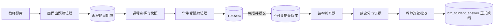
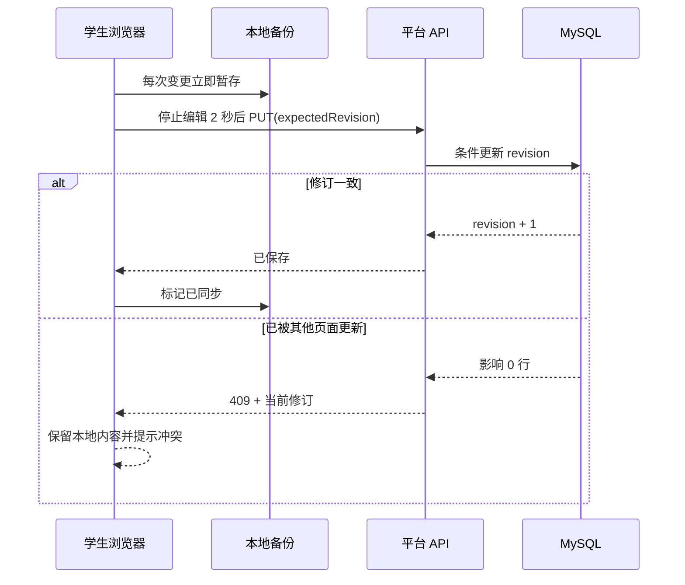

# 画程：流程图操作题技术设计

> 基线：Vue 3 + Vite + Element Plus；Spring Boot / Java 8 / MyBatis / MySQL。

## 1. 总体结构



LogicFlow 只负责浏览器中的图编辑与只读渲染。平台后端拥有身份、权限、题目配置、草稿、提交、规则快照和成绩。

## 2. 前端设计

### 2.1 共用组件

新增 `src/components/FlowchartEditor/`：

- `FlowchartEditor.vue`：LogicFlow 生命周期、数据导入导出、只读和受限编辑。
- `FlowchartQuestionDesigner.vue`：标准答案、学生基础图、权限和检查规则四个页签；提供“从标准答案复制一份”。
- `StudentFlowchartDialog.vue`：学生草稿、本地备份、自动保存、冲突和明确提交。
- `FlowchartGradingPanel.vue`：学生提交、标准答案、检查证据和建议分。
- `schema.js`：前端文档规范化、默认权限和本地校验。
- `localDraft.js`：localStorage/IndexedDB 短期备份，键包含用户、课程和题目。

首期工具栏直接收敛在 `FlowchartEditor.vue`，避免为很小的节点库过度拆分。开始与结束是两个独立按钮，但都写入 `terminal` 类型，分别带默认文字“开始”“结束”；处理、判断、输入/输出保持各自类型。每个节点按钮同时绑定单击添加和 HTML5 拖放，拖放落点经 LogicFlow 画布坐标转换后创建，适配缩放与平移。节点或连线被选中后显示“删除节点/删除连线”，最终仍由题目权限和元素锁定共同决定是否允许删除。

`PolygonNodeModel` 的点集必须使用以图形左上角为原点的非负坐标。输入/输出节点采用 `[[12,0],[140,0],[128,60],[0,60]]`；若使用相对中心的负坐标，LogicFlow 会再次扣除半宽高，导致图形向左上偏移而文字留在右下角。创建节点时文字坐标显式写为节点中心，保存与重载也由 `schema.js` 恢复为节点中心。

编辑模式：

- `AUTHOR_ANSWER`：教师标准答案。
- `AUTHOR_STARTER`：教师基础图及元素锁定。
- `STUDENT`：题目级权限与元素锁定共同生效。
- `READONLY`：教师批改、学生已提交查看。

### 2.2 页面接入

- 题库页：`practicalMode=FLOWCHART` 时隐藏文件上传和 Python 配置，显示“编辑标准答案”“编辑基础图”“生成检查规则”。
- 课程设计器：把 `FLOWCHART` 展示为“画程流程图”，沿用操作题选择与分值。
- 题库管理和课程设计器：通过只读预览接口展示学生基础图；公开题预览仅返回基础图，标准答案和规则仍只允许创建者或管理员通过编辑配置接口读取。
- 学生首页：流程图题显示“打开画程”，不显示文件上传；弹出或全屏编辑后自动保存并明确提交。
- 教师批改：流程图题不走 Office/PDF 预览，改为只读画布＋检查面板；分数保存继续走现有接口。

## 3. 文档格式

```json
{
  "schemaVersion": "1.0",
  "nodes": [
    {
      "id": "n1",
      "type": "terminal",
      "x": 320,
      "y": 80,
      "text": "开始",
      "properties": { "locked": true, "textEditable": false }
    }
  ],
  "edges": [
    {
      "id": "e1",
      "type": "polyline",
      "sourceNodeId": "n1",
      "targetNodeId": "n2",
      "text": ""
    }
  ]
}
```

只允许 `terminal`、`process`、`decision`、`inputOutput` 四类节点及 `polyline` 连线。服务端重新解析并输出规范 JSON；未知字段、HTML、URL 和外部资源拒绝或剔除。

## 4. 数据模型

### 4.1 `biz_flowchart_question`

- `question_id`：主键，关联统一题库。
- `schema_version`：文档规范版本。
- `starter_json`：基础图。
- `answer_json`：标准答案。
- `permissions_json`：题目级学生权限。
- `rules_json`：教师确认后的结构检查点。
- `config_revision`：配置修订号。
- 审计时间和创建/更新人。

### 4.2 `biz_flowchart_lesson_snapshot`

- 按 `lesson_id + question_id` 唯一。
- 冻结基础图、标准答案、权限和规则 JSON，以及题目配置修订号。
- 课程保存/首次作答前创建；已有快照不被题库后续编辑覆盖。

### 4.3 `biz_flowchart_draft`

- 按 `student_id + lesson_id + question_id` 唯一。
- 保存 `document_json`、`revision`、`base_submission_version` 和更新时间。
- `UPDATE ... WHERE revision = expectedRevision` 实现乐观并发；影响行数为 0 返回冲突及当前修订。

### 4.4 `biz_flowchart_submission`

- 每次正式提交一行，按学生/课程/题目递增 `version_no`。
- 冻结 `document_json`、`rules_snapshot_json`、`check_result_json`、`suggested_score`、`submit_time`。
- 不修改历史版本；补交生成新行。
- 提交事务同步插入或更新 `biz_student_answer`，`student_answer` 保存受控引用 `FLOWCHART:<submissionId>`，正式 `score` 保持空值直到教师确认。

不在 `biz_student_answer` 新增画程外键列，避免影响现有答案归档表和文件作品迁移；画程提交通过学生、课程、题目和版本表查询，引用字符串只用于让现有成绩/批改主链识别“已提交”。

## 5. API

### 教师题目配置

- `GET /business/flowchart/question/{questionId}`：读取配置。
- `GET /business/flowchart/question/{questionId}/preview`：读取选题预览，仅返回学生基础图；创建者、管理员或公开题可访问。
- `PUT /business/flowchart/question/{questionId}`：保存配置，携带 `expectedRevision`。
- `POST /business/flowchart/question/generate-rules`：从请求中的标准答案生成检查点草稿。

### 学生

- `GET /business/flowchart/student/workspace?lessonId=&questionId=`：返回课程快照、草稿和最新提交摘要。
- `PUT /business/flowchart/student/draft`：自动保存，携带预期修订号。
- `POST /business/flowchart/student/submit`：把当前草稿冻结为正式提交并执行结构检查。
- `POST /business/flowchart/student/reopen`：补交允许时从最新提交建立新草稿。

### 教师批改

- `GET /business/flowchart/grading/submission?lessonId=&questionId=&studentId=&version=`：读取正式提交、标准答案和检查结果。
- 正式成绩继续使用现有操作题评分接口，不新增第二套成绩写入。

## 6. 结构检查算法

1. 校验并规范化学生文档。
2. 为节点生成比较特征：节点类型、规范化文字、教师配置关键词。
3. 使用标准答案节点 ID 优先匹配；对学生新增节点使用“类型＋文字规则”匹配，禁止仅按坐标匹配。
4. 检查必需节点是否存在且类型正确。
5. 在匹配后的节点映射上检查有向边、边文字及判断分支。
6. 每个检查点输出 `PASS/MISSING/WRONG/REVIEW`、说明、得分比例和涉及节点 ID。
7. 只汇总启用且计分检查点；按题目满分折算建议分，最终分由教师保存。

文字规范化：Unicode NFKC、转小写、去首尾及连续空白、忽略配置内常见标点；关键词和同义答案由教师显式配置。首期不做模糊 NLP 或 AI 推断。

## 7. 并发、草稿和本地备份



正式提交必须在事务中锁定草稿和当前最大版本；同一草稿修订重复提交返回已有结果或严格防重，不能生成多份同版本提交。

两个页面同时首次打开时，草稿插入使用唯一键和 `ON DUPLICATE KEY UPDATE` 原子收敛到同一行；只处理预期的唯一键竞争，连接、字段或 SQL 等其他异常必须继续抛出。

## 8. 权限

- 题目配置：题目创建者或管理员。
- 学生工作区：本人学生身份＋当前班级当前课程＋课程包含该题＋`practical_open=1`。
- 教师批改：课程创建者或负责当前班级的共享教师，复用现有教师班级范围判断。
- 服务端不接受请求体传入的学生 ID 作为学生接口身份。

## 9. 发布与回滚

- SQL：`sql/flowchart_operation_v1.sql`，先备份、前检、执行和后检。
- 应用：后端 clean package、前端 build 后发布到新 release；后端和前端均需切换。
- 回滚应用：切回上一 release。
- 回滚数据：首期新表无旧业务依赖，可停用 `FLOWCHART` 入口后保留数据；确需物理回滚时先导出四表，再按外键依赖逆序删除。不得删除已产生的学生作品而不留备份。

## 10. 测试设计

- Java：文档校验、文字规范化、规则生成、拓扑检查、建议分、草稿并发冲突、重复提交幂等、学生/教师越权。
- Mapper：唯一约束、修订条件更新、版本递增和最新版本查询。
- 前端：文档规范化、本地草稿键和保存状态单测。
- 构建：业务模块测试、后端 clean package、Vue3 build。
- 浏览器：教师出题→课程选择→学生作答/刷新恢复/提交→教师批改确认；另做跨学生和未开放探针。
- 教师设计器专项：开始/结束独立、单击添加、拖拽落点添加、节点删除、连线删除、输入/输出文字居中及四边中点锚点、标准答案复制基础图及覆盖确认。
