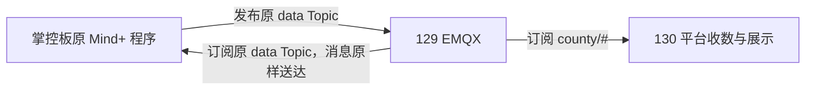

# ADR-004：修复原 data 订阅，取消平台自动判定下发

> 日期：2026-09-16；状态：130 已发布，掌控板真机复验待完成。
> 用户本轮明确需求取代 ADR-003 的 AI/关键词下行决策。

## 问题与决定

设备原程序向 `county/169/274/2024-02/guangzhao/group02/data` 发布并订阅同一主题。ADR-003 只新增 control 订阅且仅用临时账号验证，未修复原程序的 data 订阅。平台不应为了订阅权限修复改变消息含义或要求更换设备模板。

班级 ACL 增加本班 `/+/+/data` 的 subscribe allow。线上原规则完整保留，兼容 control 订阅，不改账号、口令或扩大跨班权限。后续平台同步同时生成 publish data、subscribe control、subscribe data；班级共享账号只能隔离到班级，不能识别同班不同设备小组。

移除 IotDownlinkService 的事件监听、AI 判定、关键词兜底与发布实现。旧接口保留小组访问校验后返回 published=false，防止已打开的旧页面继续下发。教师/学生物联页面及小学模板恢复到本轮自动下行前的版本，取消下发弹窗与强制命令。独立 `/aiot-lamp/` 服务不在本次修改范围。



## 已验证

- 真实班级账号 class_169_2024_02，原 Topic SUBACK 修改前128、修改后0；跨班及 county/# 均128。
- 14班级ACL写前备份、PUT全部204、回读一致。未写测试课堂消息，未修改真实设备程序。
- 28项Iot相关Java测试零失败，Vue3构建成功。
- 基于线上JAR替换IotEmqxAdapter和IotDownlinkService两个类，删除废弃内部Decision类，其他条目内容保持一致。
- 130新release为 `/data/apps/xueyeceping/releases/20260916_iot_subscribe_fix_v1`；三服务active，首页/验证码/课堂context路由/独立工具HTTP200。context未登录检查只证明路由可达。
- 新前端制品无自动判定/指定命令文案，入口资源可达；浏览器仅到登录页，登录后业务界面未实测。
- 发布草稿1.30.12 / update_id=92，登记脚本 `sql/iot_subscribe_fix_release_note_20260916.sql`；无业务结构迁移。

证据与完整SHA-256见 PROJECT_CORE.md v3.65、`output/iot-subscribe-fix-20260916/`。

## 回滚

备份目录 `/data/backups/xueyeceping/20260916_iot_subscribe_fix_v1`。本次保留原release，因此按以下步骤恢复配置即可：

```bash
sudo cp -a /data/backups/xueyeceping/20260916_iot_subscribe_fix_v1/service.before /etc/systemd/system/xueyeceping-130.service
sudo cp -a /data/backups/xueyeceping/20260916_iot_subscribe_fix_v1/nginx.before /etc/nginx/sites-available/xueyeceping-130
sudo cp -a /data/backups/xueyeceping/20260916_iot_subscribe_fix_v1/env.before /data/apps/xueyeceping/shared/xueyeceping-130.env
sudo systemctl daemon-reload
sudo systemctl restart xueyeceping-130
sudo nginx -t && sudo systemctl reload nginx
```

这会恢复上一轮自动下行配置。如仍须停用自动下行，应在重启前将 IOT_DOWNLINK_ENABLED 保持 false。ACL与代码分开回滚；恢复本机acl-before备份将再次拒绝data订阅，不应自动撤销。数据库仅新增发布草稿，无需恢复整库。

## 未完成与下一步

用户在原程序中重新连接MQTT，再执行原订阅积木，确认无128并验证回调。不能把MQTT探针结果标为真机闭环。串口另有mpython.get_x的ETIMEDOUT，本轮未排查，不能把它归为订阅权限问题或宣称已修复。
