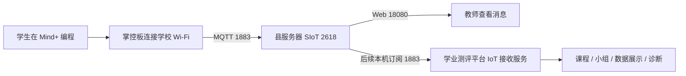
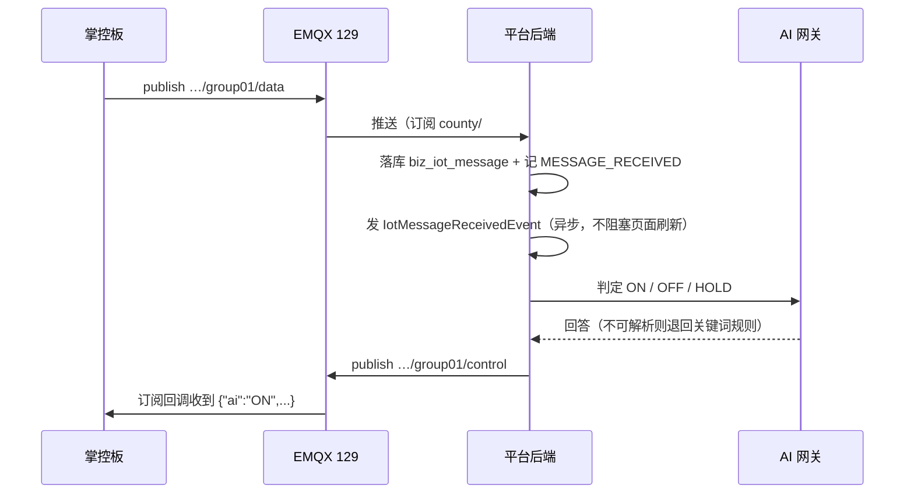

# 初中物联网县级 SIoT PoC 设计

> 2026-09-16 19:10 修正：当前为原 data Topic 发布/订阅，平台不再判定命令或自动下发。130 已切 `20260916_iot_subscribe_fix_v1`；真实班级账号原 Topic SUBACK 128→0、跨班仍128，28项测试通过。真机及登录后页面待验；见 PROJECT_CORE.md v3.65 和 junior-iot-poc/ADR-004-original-data-subscription.md。以下相冲突的自动下行记录仅为历史。


## 1. 架构



Mind+ 是编程工具，平台不替代它。SIoT 是 MQTT Broker（消息中转服务器）；本阶段先证明掌控板到县服务器、县服务器到订阅程序两段链路均成立。

## 2. 已部署拓扑

### 2.1 EMQX 并行兼容测试（2026-08-19，进行中）

Mind+ 下拉框目前只有阿里云、OneNet、Easy IoT、SIoT，没有 EMQX 专用模块。因此只允许以真实掌控板验证 SIoT 积木是否可连接标准 MQTT，验证通过前不替换 `10.52.1.123` 的 SIoT 服务。

| 项 | 当前值 |
| :--- | :--- |
| EMQX 主机 | `10.52.1.129`（并行兼容验证） |
| MQTT 测试端口 | `1883/TCP`（兼容 Mind+ SIoT 模块默认端口） |
| 管理端口 | `18083/TCP`，仅绑定 `127.0.0.1` |
| 镜像 | EMQX 5.8.8，摘要固定为 `sha256:4593b6e30196754779fa14483332cb0be56c233f1c8a387b1308bec4337c0144` |
| 容器 | `school-emqx-poc`，Docker `restart: unless-stopped` |
| 自启动 | `emqx-school-poc.service`，systemd enabled/active |
| 防火墙 | 仅 `10.52.0.0/16 -> 1883/tcp`；未放行 18083/8883 |
| 数据与日志 | `/srv/emqx-school-poc/data`、`/srv/emqx-school-poc/log` |

服务器直连 Docker Hub 超时，使用该服务器已有 `dockerproxy.net` 代理拉取并锁定镜像摘要；未使用未知镜像。

当前验证：`school-emqx-poc` 已启用 `restart=unless-stopped` 与 `emqx-school-poc.service`；错误密码得到 CONNACK 4，测试设备仅可访问自己的 `county/test/device01/#`，跨设备订阅返回 SUBACK 128。管理端仅回环绑定，浏览器和学生设备没有管理凭据。

2026-08-20 用户现场确认：Mind+ 的 SIoT 模块连接 `10.52.1.129:1883` 的 EMQX 成功。故 P2 正式目标 Broker 为 EMQX；`10.52.1.123` 的 SIoT 保留、未修改，仅作可回退的历史课堂链路。

回滚：停止并禁用 `emqx-school-poc.service`，移除该服务添加的两条 `DOCKER-USER` 1883 规则即可关闭测试入口；保留 `/srv/emqx-school-poc` 目录和检查备份，不删除数据。不会影响 SIoT、Judge0、CryptPad 或平台服务。

| 项 | 当前值 |
| :--- | :--- |
| 主机 | `10.52.1.123` |
| MQTT | `1883` |
| Web | `18080` |
| Windows 服务 | `CountySIoTPoc`，Automatic |
| 发布目录 | `D:\program\siot-poc\releases\20260811_161357_2618` |
| 日志目录 | `D:\program\siot-poc\logs` |
| 防火墙允许范围 | Domain/Private 下的 RFC1918 私网地址 |

SIoT 同时监听 1888（MQTT WebSocket）和 8883（TLS），本次 Mind+ 物理测试只使用 1883；教师网页只使用 18080。

## 3. Topic 约定

PoC 使用：

```text
poc/{学校短码}/{教师短码}/{组号}/{数据名}
```

示例：

```text
poc/dmw/zdx/group01/light
```

正式平台阶段统一使用服务端生成且不可自由碰撞的 Topic：

```text
county/{学校ID}/{课程ID}/{班级ID}/{实验ID}/{小组ID}/{设备ID}/data
```

其中 `{班级ID}` 由届别和班号组合为一个稳定段；所有设备连接 EMQX `10.52.1.129:1883`，新建实验不创建端口。平台通过 EMQX 管理 API 为每个设备建立独立强密码账号，ACL 仅允许该账号发布自己的精确 data Topic；平台专用订阅账号才可订阅 `county/#`。浏览器不得持有全县共享 MQTT 凭据或管理 API 凭据。

设备配置体验按“教师建组时生成，课堂中仅复制一次”设计：设备账号使用可识别的短编码，密码使用易区分字符集的强随机串；账号、密码、Topic 只在创建设备或教师主动轮换时显示。平台不向学生页面下发管理账号，不以学校共享弱密码替代 ACL。

## 4. 诊断分层

| 层级 | 平台或教师能看到的证据 | 典型结论 |
| :--- | :--- | :--- |
| Wi-Fi | 掌控板屏幕显示连接状态、重连次数 | SSID、口令、2.4GHz、信号或 AP 隔离问题 |
| 路由/TCP | 教师机 Web 是否可开；设备 MQTT 是否能建立 TCP | 学校到县服务器路由或端口策略问题 |
| MQTT 认证 | Broker 返回 CONNACK；服务日志记录连接失败 | 服务器地址、账号或密码错误 |
| Topic/发布 | MQTT 已连接，但指定 Topic 无消息 | Topic 拼写、发布积木或程序循环问题 |
| 平台接收 | Broker 有消息，但平台最后接收时间不更新 | 平台订阅、Topic 映射或接收服务问题 |

如果设备连 Broker 都没有到达，县平台无法凭空知道掌控板的 Wi-Fi 密码或无线信号问题。因此真实版本必须把“Wi-Fi 状态、MQTT 状态、发送计数、最近错误”显示在掌控板屏幕上，并在平台侧展示 Broker 所能观察到的连接和消息证据。

## 5. P1 通过后的平台接入边界

P1 已由用户在真实掌控板上确认通过。平台接入沿用本设计：后端服务订阅 SIoT 的 MQTT 1883，解析数字文本和 JSON，按服务端生成的 Topic 映射到课程实验/班级/小组/设备；教师页面只访问平台后端，不直接访问 Broker 管理接口。现有课堂 WebSocket 仅作为实时推送基础，不改变其课堂控制消息协议。

## 6. 当前边界

2618 默认单账号适合验证，不适合直接作为多校正式权限模型。完成真实掌控板验证后，正式接入需要增加平台自己的课程、小组、设备令牌和 Topic 授权层；是否继续使用 SIoT 作为底层 Broker，要在多校隔离、审计和稳定性压测后决定。

## 2026-08-19 进度补充
P2 平台代码、幂等 SQL、模拟器、后端测试和 Vue3 构建已完成；正式上线未完成。正式 SIoT 原始数据库备份已恢复，CountySIoTPoc 保持 Running。新增平台订阅账号的 MQTT 认证实际返回 CONNACK 5，因此未执行正式后端切换、正式库迁移或教师浏览器上线验收；该问题是当前上线阻断，需先按 SIoT 2618 的真实认证/Topic 管理方式解决。

## 7. 2026-08-24 工作台展示设计

- 首页只负责选课程与班级，工作台从路由参数初始化班级，但所有接口仍以服务端教师范围校验为准。
- 总览数据由现有小组统计派生 `hasRecentActivity` 和“只看有数据”计算列表，不新增表或实时状态字段；实时窗口固定为最近 2 分钟。
- 详情复用既有明细接口与分页，以 `el-dialog` 承载；设备编码只有不等于小组级哨兵 `data` 时才追加在格式列，避免恒值来源列制造噪音。

## 8. 2026-09-16 AIoT 双向下行设计（本地已实现，未发布）

> 决策依据与验证证据见 `ADR-003-iot-bidirectional-downlink.md`；根因见 `bidirectional-downlink-analysis.md`。

### 8.1 实际使用的 Topic 形状

实现中小组主题为 **6 段**（上文第 3 节的 7 段写法为早期草案，实际按下式落地）：

```text
上行  county/{学校ID}/{课程ID}/{班级ID}/{活动码}/{groupNN}/data
下行  county/{学校ID}/{课程ID}/{班级ID}/{活动码}/{groupNN}/control
```

- 班级账号 ACL 只能约束到 `county/{学校ID}/{课程ID}/{班级ID}`，即 `…/+/+/data` 与 `…/+/+/control`。
- 下行主题由该组**已入库的上行主题**换末段得到，保证与设备订阅严格配对。

### 8.2 双向链路



### 8.3 安全与降级

- `iot.mqtt.downlink-enabled` 默认 `false`：关闭时不判定、不发布，也不改平台账号 ACL，代码上到正在上课的服务器行为不变。
- 教师手动下发走 `POST /business/iot/groups/{groupId}/downlink`，权限沿用实验管理边界（`canManageExperiment`），教研员只读、无关教师拒绝。
- 上行只认 `/data`；设备若把消息发到 `/control`，记 `UPLINK_TOPIC_REJECTED` 并拒收，不污染学生数据。
- 载荷为短 JSON（<200 字节）：`{"ai":"ON","reason":"...","text":"...","source":"platform","ts":...}`。

### 8.4 已知限制

班级账号为全班共用（`class_{学校}_{届别}_{班号}`），Broker 只能约束到班级前缀，**同班 A 组可订阅 B 组的 control 主题**；平台侧只校验教师权限，不校验设备身份。课堂场景可接受；若需强隔离，须改为「每组独立账号」，属另一次决策。
