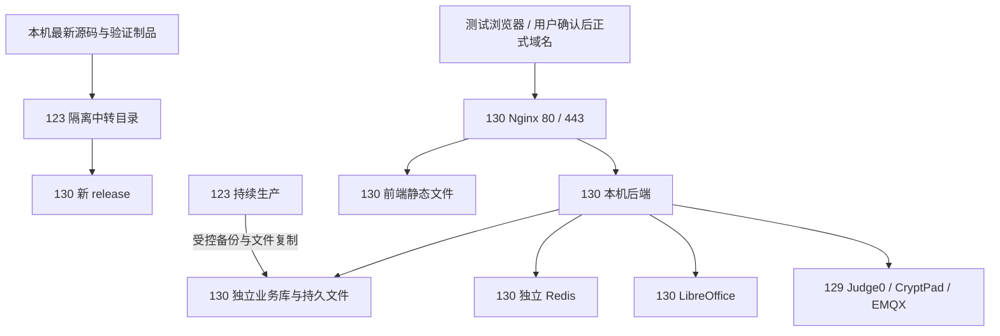

# 130 迁移与功能修复设计草案

日期：2026-09-09。所有目标目录、门槛和新增行为均为设计建议，非服务器已经配置的事实。未确认关键路线之前不实施架构或删除语义修改。

## 1. 访问方式与拓扑

推荐 130 的 Nginx 直接在 80 提供 HTTP、在 443 提供 HTTPS，静态页面直接读取当前前端目录，`/prod-api/` 和 WebSocket 反代到 130 本机后端。后端可继续使用内部 3009，按实际配置核实；不必为了迁移改端口。3010 可不开放，也无需用户记住。

- 校内试用：`http://10.52.1.130`，前提是 80 已放行、对应 server 块能匹配 IP。
- 正式推荐：`https://xxkj.xsedu.net.cn`，需证书、443 与实际网络入口；正式域名方案在切换前验收。
- DNS 不设置端口；浏览器省略端口时 HTTP 用 80、HTTPS 用 443。不能把“域名解析到 130”当成 Nginx 配置已完成。
- `10.52.1.130` 是私网地址。校园 DNS 可直接指向它；若要求校外访问，须核实现有公网/NAT/网关入口，不能让公网用户直接访问私网 IP。
- 主站不加端口，不代表 CryptPad 主站/沙箱能够合并到同一来源。必须保留其来源隔离规则，单独设计协作入口。

### 访问路线比较

| 方案 | 优点 | 缺点 | 建议 |
| --- | --- | --- | --- |
| 130 主站 80/443，后端内部 3009 | 地址简洁，符合用户要求，静态直出避免套娃 | 需配置域名/证书及网络入口 | 推荐，待最终方案确认 |
| 130 沿用对外 3010 | 与旧 IP 访问习惯一致 | 需加端口，域名解析无法隐藏端口 | 仅临时验收备用 |

## 2. 123 保护策略

允许未来执行的只读探查：读取服务状态、配置的非敏感项、版本哈希、按日期读取日志、查询业务库和文件索引。全库扫描及文件哈希也会产生 IO，安排低峰、分批限速并观察 123 响应。

备份/中转属于有限写磁盘操作：只进入新建专用目录，绝不覆盖 release、上传源文件、现有备份或配置。提前检查“备份 + 文件包 + 中转制品”的峰值空间，低空间即停止中转，不清理旧备份腾空间。

禁止执行旧 `scripts/deploy.py deploy/rollback` 来迁移 130：它针对 123 的生产服务。130 发布脚本必须独立目标校验，核对 hostname、IP、SSH 指纹、目录及服务名；不能只改 IP 就复用 Windows 发布引擎。

当前任务不授权改变 129 的在线共享配置。若 130 集成需要改变 129 对外地址，先给出兼容双入口或隔离演练方案。当前 123 服务保护约束在域名切换后仍有效，旧服务退役必须另行确认。

## 3. 130 基础核查与目录

先只读核验 `/data` 是否真实挂载、UUID 持久化、空间/权限、软件版本、服务自启、时区。禁止重跑旧初始化文档中的分区和格式化命令。检查 Linux 文件大小写、字符集、中文字体与文件名、MySQL 表名大小写规则、SQL mode/排序规则、数据库时区、JDK 与 Office 实际兼容性。

候选目录优先沿用已规划路径，不另起多个上传根：

| 用途 | 建议固定路径 | 要点 |
| --- | --- | --- |
| 上传与作品根 | `/data/upload` | 稳定持久，不放 release 内；保持相对层级 |
| MySQL | `/data/mysql` | 由 mysql 管理；通过逻辑备份导入，不复制 Windows datadir |
| Office 临时/转换工作区 | `/data/libreoffice` | 与源文件隔离，可写权限、字体和任务并发实测 |
| 应用日志 | `/data/logs/xueyeceping` | 130 日志源明确，轮转与磁盘容量检查 |
| 备份 | `/data/backups/xueyeceping/<批次>` | 数据库、文件清单、配置与校验值对应同一批次 |
| 版本制品 | `/data/apps/xueyeceping/releases/<版本>` | 前后端成套，当前版本链接可切换 |
| 外置配置 | `/data/apps/xueyeceping/shared/config` | 凭据不入仓库，禁止把 123 密钥直接写入提示词 |

目录如果已存在并投入使用，先核对现场后复用。服务依赖 `/data` 挂载，避免数据盘缺失时启动并写入系统根盘的同名目录。

## 4. 数据库和文件完整迁移

### 4.1 清单先行

从实际配置、Mapper 和库中索引字段归纳全部资料来源，形成 `source-path → target-path → URL规则 → 关联表/字段 → 校验方式` 清单。至少覆盖题目 Word/Excel/PPT 模板、题目图片与附件、学生上传原件、文件版本、缩略图/PDF 预览、流程图 JSON/快照/提交/渲染图、导学单资料、教研富文本图片与附件、头像和其他页面使用的上传文件。

区分数据库内 JSON、普通磁盘文件、可重建缓存、129 CryptPad 文档和其他外部链接。流程图不是默认只有一个目录，数据库版本引用和截图也要查。先统计现有缺失文件，避免把历史缺失误判为迁移丢失。

### 4.2 一致性备份与演练导入

1. 查询 123 实际业务库名、版本、表引擎、表数、视图/触发器/过程/事件和必要账号权限；“整库”是平台完整业务库，不覆盖 130 的 MySQL 系统库。
2. 在低峰形成可还原的逻辑全库备份，记录开始/结束时间、大小与 SHA-256。事务表可使用一致性快照；遇到非事务表不能假定在线导出一致，也不擅自全局锁库。
3. 以独立演练库恢复到 130，检查表/视图数、关键行数、关键业务聚合、约束和孤儿引用；实际完成恢复才称备份可用。
4. 按本机最新代码与正式库差异建立迁移清单，只在本地/130 通过前检后执行所需增量 SQL；不能把旧文档列出的 SQL 全部重跑。
5. 复制文件保持目录层级与中文名，分批可续传；源端与 123 中转、130 目标对制品比对 SHA-256，文件清单记录相对路径、大小、哈希、复制结果。
6. 针对索引指向的原始文件做完整存在性检查；复制批次做哈希核对。源文件在复制中变化时重试并标记，演练阶段不虚报“最终一致”。

### 4.3 路径适配

首选“可配置上传根 + 稳定相对路径/资源 URL”；扫描配置、Java、SQL、JSON 和富文本中的盘符、反斜杠、123 IP、旧域名和 release 路径。禁止整库字符串替换 IP 或盘符；外部教师工具链接与历史正文不是全部都应迁移。

数据库中确需修改的绝对路径，在 130 备份后运行字段白名单迁移脚本，支持 dry-run、变更计数、幂等和精确回退；保留文件 ID、版本 ID、课程/学生/答案关联。127.0.0.1、本地路径和浏览器 URL 不能混用。

验收包含旧链接访问、下载文件名、中文路径、大小写、权限下载、历史版本、Word 上传→转换→教师预览→批改以及流程图保存→刷新→提交→批改。历史已有缺失单独登记，不能使用空文件或占位文件伪装修复。

## 5. 129 集成与后台任务隔离

逐项建表：调用发起方、130 内部地址、浏览器公开地址、回调地址、认证、超时、WebSocket、数据归属、是否可能影响 123。

- Judge0：130→129 的鉴权和判题可达性；查轮询/回调模式，避免结果回到 123；隔离测试提交，先低量验证，不同时对共享 129 压测。
- CryptPad：现有主/沙箱对外地址是 123:3018/3019，不能只改平台一个 URL。核查 `/api/config`、CSP、iframe、WebSocket、主/沙箱 origin、旧房间引用及文档保存。若共享配置无法同时兼容 123/130，列为切换阻塞项，不能悄悄修改 129 或以 200 宣布成功。
- EMQX：130 不能复用正在使用的生产 MQTT ClientID 连接并踢掉 123。演练默认禁用生产订阅、账号/ACL 同步和自动设备配置；仅在隔离测试命名空间和独立 ClientID 中验收。
- Quartz、自动判题恢复、Office 队列、课程推进、成绩计算、通知、清理任务和 MQTT 消费：130 导入后默认隔离或暂停有副作用任务，避免对复制的生产待办再次执行、给共享服务双发或误删文件。
- Redis：130 独立实例/命名空间，不共享 123 会话与队列；不盲目复制登录令牌和待执行队列。缓存可重建项、持久业务状态和进行中任务分别处理。

“130 可用”还需给出对 123 的剩余依赖清单。若协作或文件读取仍经 123 服务，不得宣称完全独立接管；经 123 运维跳板传输不等于运行时依赖 123 平台。

## 6. 系统诊断与日志排查

重点入口：`RuoYi-Vue/ruoyi-admin/src/main/java/com/ruoyi/web/controller/monitor/SystemDiagnosisController.java`、`RuoYi-Vue3/src/views/monitor/diagnosis/index.vue`、`src/api/monitor/diagnosis.js` 及扩展服务器监控实现。

130 页面明确展示环境标识、应用版本、采集时间、应用主机、数据库连接目标、Redis、上传根、日志根、Office 状态；129 依赖单独显示为 129，不能为了“全是130”把真实外部依赖伪标成130。迁入数据库的历史操作日志保留原时间和来源，历史错误不冒充 130 实时故障。

日志任务先做只读：2026-08-25 00:00 至 08-26 00:00 朱屹教师导入；2026-09-07 00:00 至 09-09 00:00 高频使用。全部按 Asia/Shanghai 对齐；核查日志轮转、NSSM stdout/stderr 实际路径，release 内空日志不等于无错误。

来源包括系统诊断聚合、应用异常栈、Nginx access/error、sys_oper_log/sys_logininfor、任务日志、数据库慢查询/连接池与可用的 JVM/Office 指标。先按账号/时间/API 查有限字段，再读取相邻日志；不导出无关学生完整隐私。缺失历史监控必须注明无法追溯，不补造数据。

每类记录：发生次数、去重异常数、用户影响、时间段、代表请求/堆栈、当前版本是否仍存在、根因证据、最小修复、复现与回归。重点排查 502/连接不足、重复登录、Office 崩溃、班级唯一键、导入/交卷失败；文档记录的已修故障与新缺陷分开。

## 7. 业务修复设计

### F02 流程图尖角

入口 `FlowchartEditor/FlowchartEditor.vue`、`schema.js` 和后端 `FlowchartImageRenderer.java`。核查节点样式继承、SVG stroke-linejoin、模型半径、全局 CSS 与工具栏图标；仅菱形和平行四边形改尖角，起止节点保留原形态。验证新建与旧存档，不改变节点 ID、语义、连线及评分结构。

### F03 有成绩仍能删除（必须确认后实施）

| 方案 | 行为 | 优点 | 代价 |
| --- | --- | --- | --- |
| A 逻辑删除并保留历史，推荐 | 日常入口消失，学生不能登录；历史成绩按快照可查，支持恢复 | 满足删除操作诉求，保留教学证据，易回退 | 需明确历史查询、统计和关联处理；不能仅把现有停用按钮改名 |
| B 独立历史归档后删除主记录 | 复制完整教学快照后清理主数据 | 主业务真正移除、仍可追溯 | 归档/统计改造大，一致性更复杂 |
| C 连成绩和作品彻底删除 | 按依赖顺序清理数据与可独占文件 | 完全清除 | 不可轻易恢复，必须精确备份和单独明确授权 |

用户需求已推翻“有成绩一律不能删除”的体验，但尚未确定上述语义。不得直接删除 `AnswerDeletionGuardService` 拦截，或默认级联清空成绩。

分析 `BizLessonServiceImpl`、学生服务、删除守卫与 Mapper：答案、签到、Python 提交、流程图、文件版本、协作房间、小组、物联、导学单、抽测/免抽测和监管统计。核查跨课共享作品和用户账号关联，不能删除仍被别人引用的文件。验收单删/批删、跨校越权、重复请求、事务失败回滚、恢复/历史查询、统计分母和当前课程推进。

### F04 菜单

先查教师真实 `getRouters`、`sys_menu`、`sys_role_menu` 与静态路由，给出旧→新映射。不硬编码全角色共用菜单；保留组件路径、权限字符串和旧深链接兼容。如需 SQL，生成仅限目标菜单的幂等脚本和回滚，只执行在本地/130。父菜单可见性由实际子项权限决定。

### F05 工具按钮

补回当前文件缺失的新增/移除事件，兼容详情中工具列表为空；检查课程保存是否静默丢弃半填行，改为明确校验或提示。工具名与 http/https URL 校验、编辑权限在服务端兜底；已有工具不被丢失。编译通过之外必须实际点击并保存刷新、学生可见。

### F06 分享留言

基于现有 token 哈希、过期与撤销校验新增受控公开留言 DTO/分页。令牌必须绑定当前主题；每页、图片及附件代理都重新校验。不可直接复用登录后的全部帖子响应或放开内部 ID 接口。默认只读、排除隐藏/删除内容；富文本过滤和图片白名单延伸到被允许公开的留言。账号和内部附件不随 DTO 泄露。

同一分享链接正文编辑后展示最新还是固定快照，推荐沿用现有正文机制并记录编辑时间；范围变化需更新原 ADR-004 的边界，不能保留互相矛盾的文档。

### F07 通知编辑

先确认用户指的是活动 NOTICE 还是通知栏提醒；当前已有主题编辑接口。用作者真实角色排查 `topic.owner`、edit 权限、主题类型与当前部署版本，优先修正入口或权限投影。正文/标题/活动时间修改后刷新一致；不默认重发所有提醒，不重置已读状态，不将管理删除权限自动变成编辑所有人的权限。

### F08 Python 导入与权重

先取证，再按模板下载→双 Sheet 表头→解析→预览→DTO→导入校验→存储→编辑回显→判题计分逐层比对。检查旧模板缺列、中文列名差异、空权重默认值、百分号与小数、样例/隐藏测试点以及重复外部编号。

已知后端要求测试点权重合计 100，优先提供明确权重列和预览编辑入口，支持用户主动点击“平均分配”，不悄悄改变既有权重。若采用平均分配，按受支持精度分配余数以保证合计100；实际舍入规则、单点范围以模型核查后确定。区分课程分值与测试点百分比。验收不等权重如20/30/50、空值、非法值、合计非100、多题、旧模板、重复导入及错误行定位；失败不应留下半题/孤儿测试点。

## 8. 发布、最终同步与切换

分为两次门禁：G1 为“130 演练可用，具备安排最终同步条件”；G2 为“最终一致性核对通过，等待用户切域名”。G1 不能宣称数据已经最新。

同步路线比较：

| 方案 | 优点 | 缺点 | 推荐 |
| --- | --- | --- | --- |
| 预复制 + 用户确认后的短暂业务停写 + 最终数据库/文件同步 | 易验证一致性，不需要停止 123 前后端进程 | 需协调课堂结束与停写方式 | 用户已同意允许短暂停写，具体时间和方式另行确认 |
| 持续数据库增量同步 + 文件增量 + 写入归属控制 | 可缩短最终窗口 | 需要 binlog/CDC 条件与额外实施，可能触及123配置红线 | 仅完全不能停写时另立方案确认 |

即使用户同意停写，具体执行机制仍须审查：仅口头说“没人用”不足以证明无人写入；课程后台任务、WebSocket、自动判题和设备消息同样算写入。若现有系统无不改123配置的可靠停写方法，必须提出冲突，不能擅自改123前后端。禁止承诺既绝不控制旧端写入、又零丢失无缝切换。

最终同步计划：确认窗口→处理进行中的答题/上传/判题→可靠停止业务新写入（方式另批）→记录一致性时间点→最后数据库备份/恢复及已验证SQL→最后文件增量与引用校验→130隔离验证→生成G2报告→用户切换解析/入口→确认多网段真实解析和新请求归属130→只在130启用生产后台任务→观察。

DNS 缓存和已打开的旧网页可能继续写123。解除写入限制前必须防止双主写入；不能仅靠降低 TTL 保证所有客户端即时切换。若需要旧端只读/入口调整，与“绝不动123”冲突时必须单独确认，不能隐藏在发布脚本中。

回退分两种：130 未产生正式新数据时可由用户恢复入口指向123；130 已接收新答卷后不能直接 DNS 切回旧库，必须先停新写入、备份并对账/回迁新增数据，否则丢成绩。旧123保留不是完整的数据回滚方案。

## 9. 可宣布130可用的证据

1. 123 服务配置/制品哈希和运行状态未被本轮改动，业务探活正常。
2. 130 软件、挂载、自启、独立库/Redis、持久目录和备份恢复验证通过。
3. 本机源码基线、包含的本地改动、SQL、构建与前后端哈希可追溯，三段传输校验一致。
4. 全库恢复核对、文件清单与索引完整性通过；历史已缺失项如有必须明确说明并评估阻塞性。
5. 130 标识的诊断、日志、DB/Redis/Office/129 依赖状态真实，无混读123实时数据。
6. 教师/学生/教研员/管理员按实际有效账号验收；完整课程→答题→提交→批改→成绩导出；包含 Word、流程图、Python、工具、协作双人保存及权限隔离。
7. 修复项完成定向回归，菜单与公开分享完成匿名及权限反向验证。
8. 130 做低到高阶梯负载，建议错误率低于1%、交卷业务失败/重复落库/丢失为0、普通API P95不高于2秒（具体目标需结合现场确认）；Office/Python异步链单独量度，不套用普通API时延。
9. 对共享129的容量试验须隔离并避开123课堂，不为证明130而压垮129。
10. G1写明尚待最终同步；G2必须包含最终时间点、零未解释差异、单写端控制和切换/回退步骤。未经过完整上课时段观察，不声称高峰稳定性已长期证明。
