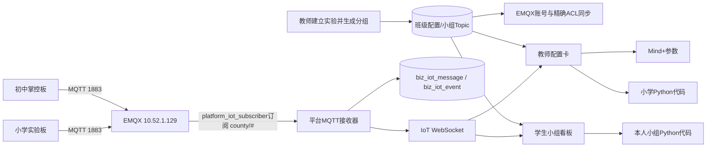
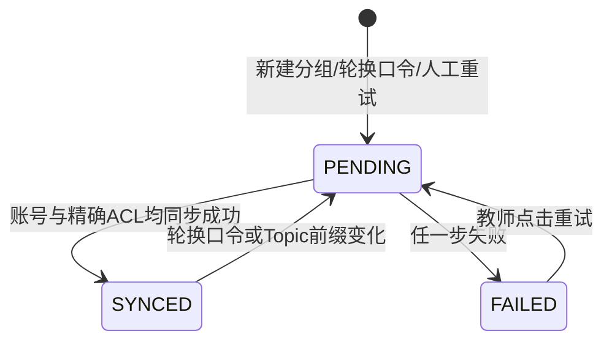

# 小学信息科技实验板正式接入平台设计

> 对应需求：`requirements.md`  
> 设计原则：复用现有链路、先收紧权限、最小新增数据、不给学生增加MQTT理解负担。

## 1. 总体决策

采用“**一个平台、一套EMQX与Topic、两种编程工具入口**”架构：

- 初中：继续使用掌控板 + Mind+ SIoT模块。
- 小学：使用信息科技实验板 + Python v1.0_N17 + `umqtt.simple.MQTTClient`。
- 两者共用班级账号、课堂口令、小组Topic、EMQX、平台接收器、数据库和数据看板。
- 平台不判断或强绑定学段，教师/学生可以在“Mind+参数”和“小学Python代码”之间明确切换。

## 2. 架构图



## 3. 组件变更

| 组件 | 类型 | 计划变更 | 不负责 |
| --- | --- | --- | --- |
| EMQX授权链 | 外部服务 | 新增内置数据库授权源、回填每班精确规则、移除宽ACL | 不新增Broker或端口 |
| `IotEmqxAdapter` | 后端服务 | 账号+ACL幂等同步、授权源健康检查、按用户名断开旧客户端 | 不把管理凭据返回浏览器 |
| `IotExperimentService` | 后端业务 | 管理Broker同步状态、失败重试、生成稳定Python ClientID | 不保存WiFi信息 |
| `IotClassConfig` | 数据模型 | 增加Broker同步状态、时间和脱敏错误 | 不新增明文密码 |
| `IotClassCardVo` | 教师DTO | 每组返回Python ClientID和同步状态 | 不返回EMQX管理凭据 |
| `IotStudentOverviewVo` | 学生DTO | 返回本人小组Python ClientID和同步状态 | 不返回其他小组配置 |
| `iotPythonTemplate.js` | Vue3共享工具 | 生成经过转义的N17 Python模板 | 不执行Python或连接Broker |
| 教师IoT页 | Vue3页面 | 双页签、逐组复制Python代码、同步失败提示/重试 | 不重做分组和数据表格 |
| 学生IoT页 | Vue3页面 | 双页签、一键复制本人代码、中文故障提示 | 不允许自由编辑Topic |

## 4. 数据模型

在 `biz_iot_class_config` 增加三个字段，不新建业务表：

| 字段 | 类型 | 含义 |
| --- | --- | --- |
| `broker_sync_status` | `VARCHAR(16)` | `PENDING`、`SYNCED`、`FAILED` |
| `broker_synced_at` | `DATETIME NULL` | 最近一次成功同步时间 |
| `broker_sync_error` | `VARCHAR(500) NULL` | 脱敏、截断后的同步错误 |

迁移文件计划：`sql/iot_primary_board_v1.sql`，要求幂等。

存量配置初始化为 `PENDING`，经回填任务逐条同步成功后变为 `SYNCED`。在所有存量配置均为 `SYNCED` 前，不得移除EMQX文件中的宽ACL规则。

## 5. Broker授权设计

### 5.1 最终授权链顺序

1. `built_in_database`：保存每个班级账号的精确发布规则。
2. `file`：仅保留平台订阅账号、必要运维测试账号和 `{deny, all}` 兜底。

班级规则示例：

```text
username = class_139_2020_07
permission = allow
action = publish
topic = county/139/252/2020-07/#
```

### 5.2 安全迁移顺序

1. 经123跳板备份129的EMQX配置、当前文件ACL和认证用户清单。
2. 创建内置数据库授权源，并放在文件源之前。
3. 按 `biz_iot_class_config` 回填所有班级账号的精确规则。
4. 对每个学校至少抽样一个账号验证“本班允许、跨班拒绝”。
5. 核对平台订阅客户端在线、现有初中设备仍可上报。
6. 删除文件ACL中的 `class_* → county/#` 宽权限。
7. 再次执行允许/拒绝测试并保存证据。

任一步失败，恢复原文件ACL和授权源顺序；不要重启或修改Judge0、CryptPad。

## 6. Broker同步状态机



处理规则：

- `PENDING/FAILED` 时不下发可运行Python代码，防止教师拿到半成品配置。
- 同步流程为幂等Upsert：重复执行只更新密码和规则，不新增重复记录。
- 失败原因只保存HTTP状态、阶段和脱敏短消息。
- 轮换口令同步成功后，通过EMQX管理API断开该用户名的现有客户端，确保旧会话不能继续发送。
- 同步失败不伪装成功；教师页面提供“重试同步”，不要求教师登录EMQX。

## 7. API和DTO契约

### 7.1 复用接口

- `GET /business/iot/class-card`
- `GET /business/iot/student/overview`
- `POST /business/iot/generate-grouping`
- `POST /business/iot/rotate-passcode`

原字段保持不变，新增可选字段：

```json
{
  "brokerSyncStatus": "SYNCED",
  "brokerSyncedAt": "2026-08-31 10:00:00",
  "brokerSyncError": null,
  "pythonClientId": "primary_g45"
}
```

教师班级卡的每个 `groups[]` 返回自己的 `pythonClientId`；学生概览只返回本人小组值。

### 7.2 新增重试接口

```text
POST /business/iot/class-config/{configId}/sync-broker
角色：admin、teacher
权限：课程创建教师、实际任教教师或管理员
响应：最新Broker同步状态，不返回管理凭据
```

研究员只读数据，不获得明文课堂口令和可运行代码。教师班级配置接口需要把“数据查看权限”和“凭据查看权限”分开校验。

## 8. Python模板

### 8.1 模板输入

- Broker、端口：平台配置。
- ClientID：`primary_g{groupId}`，数据库全局groupId保证跨班唯一；本期约束一组一板。
- Username、Password：现有班级账号和课堂口令。
- Topic：现有小组Topic。
- WiFi：保留学生填写占位符。

### 8.2 模板结构

```python
from npython import *
from umqtt.simple import MQTTClient

WIFI_NAME = "请填写2.4G WiFi名称"
WIFI_PASSWORD = "请填写WiFi密码"

MQTT_SERVER = "10.52.1.129"
MQTT_PORT = 1883
CLIENT_ID = b"primary_g45"
MQTT_USERNAME = b"平台班级账号"
MQTT_PASSWORD = b"课堂口令"
MQTT_TOPIC = b"平台生成的小组Topic"

# 连接、状态显示、发布函数和有限退避重连由正式模板统一生成。
```

模板不得包含省平台的 `mqtt.config(projectId, userId)`，也不得包含平台或EMQX管理凭据。

## 9. 页面设计

### 9.1 教师端

- 现有班级配置卡顶部增加接入方式页签：
  - “初中掌控板（Mind+）”
  - “小学实验板（Python）”
- 小学页签显示统一服务器/账号/口令和每组代码卡。
- 每组提供“复制Python代码”，同时保留Topic和组员。
- `FAILED` 时显示同步阶段、简明原因和“重试同步”；不显示代码。
- 打印页保留账号、口令和Topic，但不打印WiFi信息。

### 9.2 学生端

- 将当前固定Mind+文案改为双入口说明。
- Python页签显示“第1步复制代码、第2步填WiFi、第3步烧录运行”。
- 一键复制完整代码，并保留单独复制账号、口令和Topic的能力。
- 数据看板、历史记录和在线状态继续复用，不按硬件类型分叉。

## 10. 错误处理

| 层级 | 识别方式 | 用户提示 | 恢复动作 |
| --- | --- | --- | --- |
| WiFi | 板端连接异常 | 检查2.4G、名称、密码、客户端隔离 | 修改本地代码后重试 |
| TCP | `EHOSTUNREACH`/超时 | 学校网络无法到达129:1883 | 网络管理员检查ACL/路由 |
| MQTT认证 | CONNACK 4/5 | 账号或课堂口令错误/未同步 | 教师重试同步或轮换口令 |
| Topic授权 | Broker拒绝发布 | 使用了非本组Topic | 重新复制平台代码 |
| 平台映射 | `TOPIC_NOT_MAPPED` | 分组或Topic已失效 | 教师重新生成/核对分组 |
| 平台接收 | `MESSAGE_PROCESS_FAILED` | 平台接收异常 | 保留事件并告警，不杀死订阅连接 |

## 11. 测试策略

### 11.1 单元测试

- `IotEmqxAdapterTest`：账号同步、ACL同步、授权源缺失、客户端断开、错误脱敏。
- `IotExperimentServiceTest`：同步状态机、重试权限、研究员凭据脱敏、ClientID生成。
- Python模板测试：特殊字符转义、字段完整、无省平台变量、无管理凭据。
- 现有 `IotMqttReceiverTest`：数字、JSON、未知Topic、限流和异常隔离继续通过。

### 11.2 集成测试

- 测试账号只允许本班前缀，跨班发布被拒绝且不入库。
- 口令轮换后旧连接被踢下线，旧口令失败、新口令成功。
- 小学和初中客户端并行发布，均正确映射。
- `FAILED → 重试 → SYNCED` 全流程。

### 11.3 真板验收

- N17打开平台生成代码，只填写WiFi后运行。
- 连续10分钟、断网恢复、两组并行。
- 教师页面5秒内显示，数据库与事件一致。
- 初中Mind+真板完成回归。

## 12. 部署与回滚

### 12.1 发布顺序

1. 本地迁移、单测、后端打包、Vue3构建。
2. 生产123整库与NSSM/Nginx配置备份。
3. 129经123跳板备份EMQX授权配置。
4. 先增加内置授权源和回填规则，暂不删宽ACL。
5. 发布123后端和前端，执行SQL并验证同步状态。
6. 完成跨班拒绝和初中回归后，删除宽ACL。
7. 小学真板试点通过后删除临时账号 `primary_board_probe`。

### 12.2 回滚

- 应用：123切回上一后端/前端release。
- 数据：新增同步状态字段可保留；若必须回滚，执行配套回滚SQL。
- EMQX：恢复授权源顺序和备份ACL；认证用户数据不批量删除。
- 临时账号：按用户名精确删除，不影响班级账号。

## 13. 性能目标

- 教师/学生配置接口P95小于1秒，不把EMQX实时查询放进每次页面读取。
- MQTT消息到教师页面P95小于5秒。
- 保持现有全局5000条/分钟和单Topic限流边界，试点后再决定是否调整。
- 不新增常驻服务和新端口，不改变Judge0、CryptPad资源配额。

