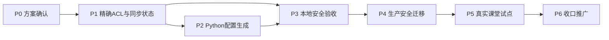

# 小学信息科技实验板正式接入平台实施计划

> 当前已完成方案、真板技术闭环、P1/P2 本地开发、生产迁移和权限隔离验收；真实课堂试点仍待现场完成。

## 项目边界

- **必须有**：精确ACL、Broker同步状态、教师/学生Python代码、真板和跨班拒绝验收、初中回归。
- **可后续增强**：多板同组、Python图形化G01专用模板、模板版本管理、设备固件升级管理。
- **不在范围**：省平台本地部署、新Broker、新消息表、考试评分、保存WiFi密码。

## P0 已完成事实与方案确认

- [x] P0.1 真实板验证标准 `umqtt.simple.MQTTClient` 可显式填写账号、密码和Topic。
  - 需求：REQ-1、REQ-4
- [x] P0.2 真实板完成129 EMQX到123平台数据库闭环。
  - 证据：消息8966、事件9025。
  - 需求：REQ-1、REQ-9
- [x] P0.3 完成现有代码、数据模型、EMQX和页面盘点。
- [x] P0.4 用户确认采用“复用现有链路 + 双工具入口 + 先修精确ACL”方案。
  - 2026-08-31 已确认并进入本地开发；生产配置仍未修改。

## P1 Broker精确授权与同步状态

- [x] P1.1 编写幂等迁移 `sql/iot_primary_board_v1.sql`。
  - 给 `biz_iot_class_config` 增加同步状态、成功时间、脱敏错误字段。
  - 存量行初始化为 `PENDING`。
  - 需求：REQ-5、REQ-6
- [x] P1.2 扩展 `IotEmqxAdapter`。
  - 检查内置授权源是否存在且顺序正确。
  - 幂等同步账号和每班Topic前缀ACL。
  - 查询并断开指定用户名的现有客户端。
  - 所有错误脱敏。
  - 需求：REQ-5、REQ-6、REQ-7
- [x] P1.3 实现Broker同步状态机和教师重试接口。
  - 修改 `IotClassConfig`、Mapper、Service、Controller。
  - `PENDING/FAILED` 不下发可运行代码。
  - 研究员不返回明文课堂口令。
  - 需求：REQ-2、REQ-5、REQ-6、REQ-7
- [x] P1.4 后端专项单测。
  - 授权源缺失、账号失败、ACL失败、重试成功、口令轮换踢线、权限边界。
  - 已验证：IoT 相关测试 15/15 通过；EMQX 管理接口契约测试 2/2 通过。

## P2 小学Python配置生成

- [x] P2.1 扩展教师和学生DTO。
  - 教师每组返回 `pythonClientId`；学生只返回本人小组值。
  - 返回Broker同步状态，不新增明文密码字段。
  - 需求：REQ-2、REQ-3、REQ-7、REQ-8
- [x] P2.2 新增共享模板生成器 `RuoYi-Vue3/src/utils/iotPythonTemplate.js`。
  - 生成N17可运行代码、WiFi占位符、状态提示、发布函数和有限退避重连。
  - 做Python字符串安全转义。
  - 需求：REQ-4
- [x] P2.3 教师配置卡增加双工具页签。
  - 保留Mind+原界面。
  - 每组增加复制Python代码。
  - 同步失败时显示重试操作。
  - 需求：REQ-2、REQ-6、REQ-8
- [x] P2.4 学生页面增加小学Python入口。
  - 三步式说明、一键复制本人代码、手工复制兜底。
  - 不修改现有数据看板和历史分页。
  - 需求：REQ-3、REQ-4、REQ-8
- [x] P2.5 前端构建和模板静态测试。
  - 成功标准：Vue3生产构建通过，模板字段和语法检查通过。

## P3 本地集成与安全验收

- [x] P3.1 本地数据库执行迁移两次，验证幂等。
  - 两次退出码均为 0；3 个字段存在；本机配置行数为 0。
- [ ] P3.2 启动本地后端和Vue3，验证管理员/教师/学生/教研员权限。
- [ ] P3.3 使用隔离EMQX或测试账号验证本班允许、跨班拒绝、订阅拒绝。
- [ ] P3.4 验证口令轮换：旧连接被踢、旧口令失败、新口令成功。
- [ ] P3.5 验证小学和初中模拟客户端并行上报。
- [x] P3.6 完成后端相关单测、fat JAR clean package、Vue3 build。
  - 本轮 IoT 相关测试 15/15 通过，Vue3 `build:prod` 退出码 0；fat JAR 构建沿用同日画程发布验证结果。
  - 需求：REQ-5、REQ-6、REQ-8、REQ-9

## P4 生产安全迁移

- [x] P4.1 只读前检。
  - 统计存量班级配置、EMQX认证账号、授权源和当前ACL。
  - 确认129只能经123跳板SSH。
- [x] P4.2 备份。
  - 123整库、NSSM、Nginx配置。
  - 129 EMQX文件ACL、授权源顺序、认证账号清单。
- [x] P4.3 执行生产SQL并发布新release。
  - 后端、前端使用新目录，保留上一release。
  - 3009、3010探活通过。
- [x] P4.4 创建内置数据库授权源并批量回填每班规则。
  - 所有存量配置达到 `SYNCED`。
  - 未全部成功时停止，不删除宽ACL。
- [x] P4.5 生产权限抽样。
  - 每校至少一个班：本班允许、跨班/跨校拒绝、订阅拒绝。
- [x] P4.6 删除 `class_* → county/#` 宽ACL并再次复核。
- [x] P4.7 验证平台订阅客户端、Judge0、CryptPad、3009、3010均正常。
  - 需求：REQ-5、REQ-8、REQ-9

## P5 真实课堂试点

- [ ] P5.1 小学教师在平台建实验、分组并复制Python代码。
- [ ] P5.2 两个小组、两块真实实验板并行连接和上报。
- [ ] P5.3 连续运行10分钟，到达率不低于98%。
- [ ] P5.4 断开WiFi后恢复，上报在30秒内恢复。
- [ ] P5.5 教师页面5秒内显示，数据库消息和事件一致。
- [ ] P5.6 初中Mind+真板完成一次回归上报。
- [ ] P5.7 轮换课堂口令并验证旧口令失败。
  - 需求：REQ-2、REQ-3、REQ-4、REQ-8、REQ-9

## P6 服务器侧收口与推广准备

- [x] P6.1 删除临时账号 `primary_board_probe` 和对应精确ACL。
- [x] P6.2 更新 `contexts/PROJECT_CORE.md`、`docs/architecture/INTEGRATIONS.md` 和发布记录。
- [x] P6.3 登记正式release与平台更新记录。
- [x] P6.4 输出教师一页操作单和故障判断表。
  - 文档：`contexts/primary-iot-integration/teacher-quickstart.md`。
- [x] P6.5 明确回滚路径并保留备份。
  - 应用回滚：切回上一 release 的 NSSM/Nginx 配置并重启；数据库回滚使用 `sql/iot_primary_board_v1_rollback.sql`，操作前保留整库备份。

## 依赖关系

## 需求追踪

| 需求 | 主要任务 |
| --- | --- |
| REQ-1 | P2、P3、P5 |
| REQ-2 | P1、P2、P5 |
| REQ-3 | P2、P5 |
| REQ-4 | P2、P5 |
| REQ-5 | P1、P3、P4 |
| REQ-6 | P1、P3、P4 |
| REQ-7 | P1、P2、P3 |
| REQ-8 | P2、P3、P4、P5 |
| REQ-9 | P3、P4、P5 |
