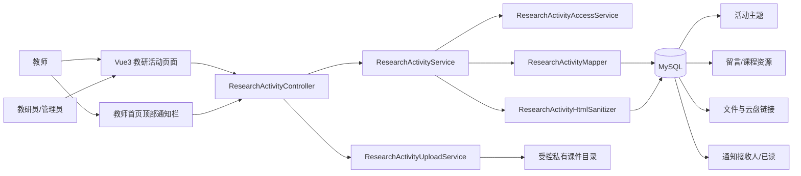
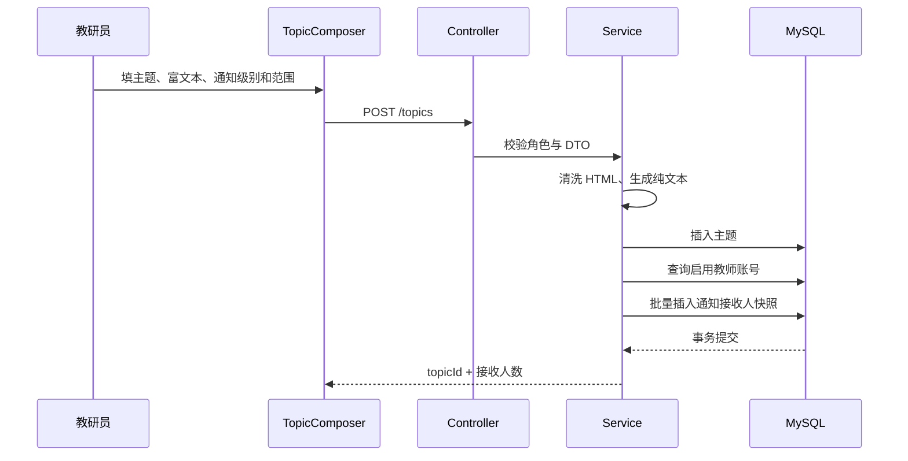
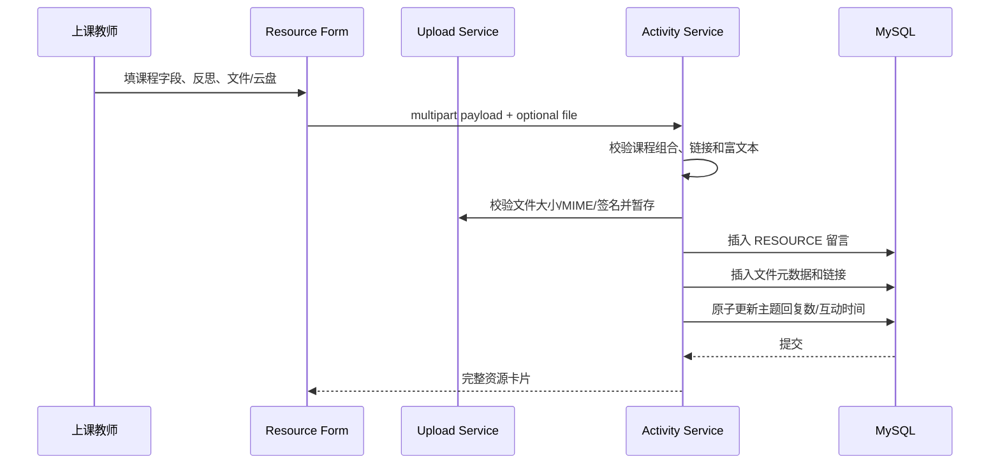

# 教研活动模块系统设计

> 版本：v1.0  
> 日期：2026-07-22  
> 对应需求：[requirements.md](./requirements.md)  
> 设计原则：最小可用、结构化资源、权限后置校验、现有技术栈优先、可回滚发布

## 1. 设计概览

本模块在现有 RuoYi / Spring Boot / MyBatis / MySQL 和 Vue3 / Element Plus 项目中新增一个独立 `researchActivity` 业务域。它不复用旧平台数据库，也不复用现有 `sys_notice` 数据模型：`sys_notice` 只有标题、正文和全局状态，没有具体接收人、已读状态和主题跳转关系，无法安全承载按学段/教师投递。

整体采用四个核心实体：活动主题、主题留言、资源项、通知接收人。主题和留言正文保存经过后端清洗的 HTML，同时保存纯文本副本用于摘要和搜索；课件文件与云盘链接作为结构化资源项保存。教师首页通过独立轻量通知接口加载，不把通知耦合进现有课程仪表盘接口，避免通知故障阻断教师课程首页。

## 2. 基线事实与约束

| 项目事实 | 设计影响 |
| :--- | :--- |
| 前端只维护 `RuoYi-Vue3` | 不修改 `RuoYi-Vue/ruoyi-ui` |
| 已安装 `@vueup/vue-quill 1.2.0`，并强制覆盖 `quill 2.0.2` | 先做表格兼容验证；默认不新增编辑器依赖 |
| 公共 `Editor` 已支持 HTML、图片选择和粘贴 | 通过可选 props 扩展，不改变其他页面默认行为 |
| Quill 2 本地包包含 table 模块和行列操作 | 增加简洁中文表格工具栏可满足一期需求 |
| `sys_notice` 无接收人和已读状态 | 新建业务通知接收人表，不改造系统公告 |
| Spring multipart 当前为 10MB/20MB | 应用和 Nginx 均需提升到可容纳 50 MiB 文件 |
| `FileUploadUtils` 默认 50 MiB，但默认扩展不含 7z | 教研活动上传服务使用独立扩展、MIME 和文件头白名单 |
| Jsoup 1.17.2 已在 `ruoyi-business` | 新建独立富文本清洗服务，无需增加依赖 |
| 教师首页第一个块目前是区域抽测评卷 | 通知栏组件插在它之前，成为第一个内容块 |
| 当前工作分支包含无关热修和未提交文件 | 实施前必须隔离分支/工作树，禁止混改或覆盖 |

## 3. 系统边界

### 3.1 范围内

- 教研活动主题和三类留言。
- Quill 2 富文本和表格增强。
- 活动图片、课后反思、一个主课件、最多三个云盘链接。
- 课程结构化搜索和主题搜索。
- 按学段或指定教师的站内通知、未读状态和首页顶部通知栏。
- 作者编辑/软删除，教研员/管理员隐藏、恢复和置顶。
- 浏览、回复、下载和云盘访问统计。
- 菜单、角色权限、数据库增量、应用/Nginx 上传限制和发布验收。

### 3.2 范围外

- 原平台数据和入口迁移。
- 学生访问。
- 传统论坛板块体系。
- 消息队列、WebSocket 实时通知、第三方推送。
- Elasticsearch、全文检索服务、向量搜索。
- 主题开启/关闭、审批、草稿和回复锁定。
- 点赞、收藏、积分、排行榜、版本历史。

## 4. 高层架构



## 5. 组件清单

| 组件 ID | 名称 | 类型 | 单一职责 |
| :--- | :--- | :--- | :--- |
| FE-01 | `researchActivity/index.vue` | Vue 页面 | 单一信息流、主题搜索、资源检索、筛选和分页 |
| FE-02 | `researchActivity/detail.vue` | Vue 页面 | 主题详情、留言筛选、发布和资源访问 |
| FE-03 | `TopicComposer.vue` | Vue 组件 | 新建/编辑主题及通知配置 |
| FE-04 | `PostComposer.vue` | Vue 组件 | 三类留言的一体化发布表单 |
| FE-05 | `ResourceFields.vue` | Vue 组件 | 课程字段、一个主课件、最多三个云盘链接 |
| FE-06 | `ResearchRichEditor.vue` | Vue 组件 | 封装现有 Editor 的表格、图片限制和专用上传地址 |
| FE-07 | `ResearchNotificationBar.vue` | Vue 组件 | 教师首页顶部未读通知和跳转 |
| FE-08 | `researchActivity.js` | API 模块 | 封装主题、留言、资源、搜索和通知请求 |
| BE-01 | `ResearchActivityController` | REST Controller | 主题、留言、搜索、通知入口和参数协议 |
| BE-02 | `ResearchActivityResourceController` | REST Controller | 课件流式下载、图片上传和链接访问计数 |
| BE-03 | `ResearchActivityService` | Service | 主题/留言/资源/通知事务和业务规则 |
| BE-04 | `ResearchActivityAccessService` | Service | 角色、作者、管理动作和资源归属校验 |
| BE-05 | `ResearchActivityHtmlSanitizer` | Service | HTML 白名单清洗、纯文本生成和图片计数 |
| BE-06 | `ResearchActivityUploadService` | Service | 文件校验、私有存储、路径解析和孤儿清理 |
| BE-07 | `ResearchActivityMapper` | MyBatis Mapper | 主题、留言、资源和通知数据访问 |
| DB-01 | `research_activity_v1.sql` | MySQL 增量 | 四张业务表、索引、菜单和角色权限 |

## 6. 建议文件结构

### 6.1 后端新增

```text
RuoYi-Vue/ruoyi-business/src/main/java/com/ruoyi/business/
├─ controller/
│  ├─ ResearchActivityController.java
│  └─ ResearchActivityResourceController.java
├─ domain/
│  ├─ BizResearchTopic.java
│  ├─ BizResearchPost.java
│  ├─ BizResearchResource.java
│  └─ BizResearchNoticeRecipient.java
├─ domain/dto/
│  ├─ ResearchTopicSaveRequest.java
│  ├─ ResearchPostSaveRequest.java
│  ├─ ResearchResourcePostSaveRequest.java
│  ├─ ResearchResourceLinkRequest.java
│  └─ ResearchNotificationSendRequest.java
├─ domain/vo/
│  ├─ ResearchTopicVo.java
│  ├─ ResearchPostVo.java
│  ├─ ResearchResourceVo.java
│  ├─ ResearchNotificationVo.java
│  └─ ResearchTeacherOptionVo.java
├─ mapper/
│  └─ ResearchActivityMapper.java
└─ service/
   ├─ ResearchActivityService.java
   ├─ ResearchActivityAccessService.java
   ├─ ResearchActivityHtmlSanitizer.java
   └─ ResearchActivityUploadService.java

RuoYi-Vue/ruoyi-business/src/main/resources/mapper/business/
└─ ResearchActivityMapper.xml
```

### 6.2 前端新增

```text
RuoYi-Vue3/src/
├─ api/business/researchActivity.js
└─ views/business/researchActivity/
   ├─ index.vue
   ├─ detail.vue
   ├─ components/
   │  ├─ TopicComposer.vue
   │  ├─ PostComposer.vue
   │  ├─ ResourceFields.vue
   │  ├─ ResourceCard.vue
   │  ├─ TopicCard.vue
   │  ├─ ResearchRichEditor.vue
   │  └─ ResearchNotificationBar.vue
   └─ utils/
      ├─ resourceForm.js
      └─ researchActivityFormat.js
```

### 6.3 现有文件最小修改

| 文件 | 修改目的 |
| :--- | :--- |
| `RuoYi-Vue3/src/components/Editor/index.vue` | 增加默认关闭的表格、上传地址、图片类型、大小和数量配置；默认行为保持不变 |
| `RuoYi-Vue3/src/views/business/teacher/index.vue` | 在模板第一行插入顶部通知栏组件 |
| `RuoYi-Vue3/src/router/index.js` | 增加主题详情和通知列表隐藏路由，主菜单由动态菜单 SQL 提供 |
| `RuoYi-Vue/ruoyi-admin/src/main/resources/application.yml` | multipart 调整为单文件 55MB、请求 60MB（业务仍限制 50 MiB） |
| `RuoYi-Vue/ruoyi-admin/.../CommonController.java` | 为受控 WebP 图片预览补充 `image/webp` Content-Type |
| `contexts/context.md` | 开发完成后更新状态、表结构、接口和发布事实 |
| `sql/research_activity_v1.sql` | 新表、菜单、权限、复核查询 |

## 7. 数据模型

项目现有业务表通常不声明数据库外键，因此本设计沿用“业务服务校验 + 索引”的方式，避免发布时因历史数据或删除顺序产生外键阻塞。

### 7.1 `biz_research_topic` 活动主题

| 字段 | 类型 | 约束/说明 |
| :--- | :--- | :--- |
| `topic_id` | bigint | 主键，自增 |
| `topic_type` | varchar(16) | `NOTICE` / `SHARE` |
| `title` | varchar(200) | 必填 |
| `content_html` | longtext | 后端清洗后的 HTML |
| `content_text` | text | 清洗后纯文本，用于摘要和搜索 |
| `notice_level` | char(1) | `0`不通知、`1`统一站内通知；`2`仅历史兼容 |
| `notice_scope` | char(1) | `0`无、`1`学段、`2`指定教师 |
| `notice_stages` | varchar(20) | 学段代码逗号串，如 `1,2`；指定教师时为空 |
| `activity_time` | datetime | 可空；活动开始前持续显示在教师首页 |
| `is_pinned` | char(1) | `N/Y` |
| `view_count` | bigint | 默认 0 |
| `reply_count` | bigint | 默认 0 |
| `download_count` | bigint | 文件下载与云盘访问累计，默认 0 |
| `last_activity_time` | datetime | 新增留言时更新，初始为创建时间 |
| `creator_id` | bigint | `sys_user.user_id` |
| `dept_id` | bigint | 发布时学校/部门快照 |
| `del_flag` | char(1) | `0`正常、`2`软删除 |
| 审计字段 | varchar/datetime | `create_by/create_time/update_by/update_time` |

建议索引：

- `idx_research_topic_feed(del_flag, is_pinned, last_activity_time)`
- `idx_research_topic_creator(creator_id, del_flag, create_time)`
- `idx_research_topic_type(topic_type, del_flag, create_time)`

### 7.2 `biz_research_post` 主题留言

| 字段 | 类型 | 约束/说明 |
| :--- | :--- | :--- |
| `post_id` | bigint | 主键，自增 |
| `topic_id` | bigint | 所属主题 |
| `post_type` | varchar(16) | `COMMENT` / `MOMENT` / `RESOURCE` |
| `content_html` | longtext | 普通正文、纪实说明或课后反思 |
| `content_text` | text | 搜索和摘要 |
| `school_type` | char(1) | 资源必填：`1/2/3` |
| `grade` | tinyint | 资源必填：绝对年级 1—12 |
| `semester` | char(1) | 资源必填：`1`上、`2`下 |
| `lesson_kind` | char(1) | 资源必填：`N`数字、`S`专题、`R`复习 |
| `lesson_no` | smallint | `lesson_kind=N` 时必填且大于 0 |
| `course_title` | varchar(200) | 资源必填 |
| `is_pinned` | char(1) | `N/Y`，只允许管理角色设置 |
| `author_id` | bigint | `sys_user.user_id` |
| `dept_id` | bigint | 发布时学校/部门快照 |
| `del_flag` | char(1) | `0/2` |
| 审计字段 | varchar/datetime | 创建/更新时间用于“已编辑” |

建议索引：

- `idx_research_post_topic(topic_id, del_flag, is_pinned, create_time)`
- `idx_research_post_filter(del_flag, post_type, school_type, grade, semester, lesson_kind, lesson_no, update_time)`
- `idx_research_post_author(author_id, del_flag, update_time)`
- `idx_research_post_course_title(course_title)`

### 7.3 `biz_research_resource` 资源项

| 字段 | 类型 | 约束/说明 |
| :--- | :--- | :--- |
| `resource_id` | bigint | 主键，自增 |
| `post_id` | bigint | 只关联 `RESOURCE` 留言 |
| `resource_type` | char(1) | `F`主课件、`L`云盘链接 |
| `resource_name` | varchar(255) | 链接资源名或文件展示名 |
| `original_file_name` | varchar(255) | 文件原名，链接为空 |
| `stored_path` | varchar(500) | 私有目录安全相对路径，链接为空 |
| `file_size` | bigint | 文件字节数 |
| `mime_type` | varchar(100) | 文件 MIME |
| `link_url` | varchar(1000) | HTTP(S) 地址，文件为空 |
| `extract_code` | varchar(64) | 可空，不写入操作日志 |
| `expire_time` | datetime | 空表示永久有效 |
| `description` | varchar(500) | 可空 |
| `access_count` | bigint | 下载/打开次数，默认 0 |
| `sort_order` | int | 文件为 0，链接按 1—3 |
| `del_flag` | char(1) | `0/2` |
| 审计字段 | varchar/datetime | 创建/更新时间 |

建议索引：

- `idx_research_resource_post(post_id, del_flag, resource_type, sort_order)`
- `idx_research_resource_expire(resource_type, expire_time, del_flag)`

“一个主课件、最多三个链接”由事务内服务校验，并通过锁定目标留言避免并发绕过。MySQL 不使用难维护的条件唯一索引。

### 7.4 `biz_research_notice_recipient` 通知接收人

| 字段 | 类型 | 约束/说明 |
| :--- | :--- | :--- |
| `recipient_id` | bigint | 主键，自增 |
| `topic_id` | bigint | 活动主题 |
| `user_id` | bigint | 具体教师账号 |
| `source_type` | char(1) | `S`学段、`U`指定教师 |
| `source_value` | varchar(32) | 学段代码或空 |
| `notice_level` | char(1) | 通知级别快照；新数据固定为 `1` |
| `read_flag` | char(1) | `N/Y` |
| `read_time` | datetime | 可空 |
| `notify_time` | datetime | 首次/再次通知时间 |
| 审计字段 | varchar/datetime | 创建/更新时间 |

约束和索引：

- 唯一索引 `uk_research_notice_topic_user(topic_id, user_id)`。
- 未读索引 `idx_research_notice_unread(user_id, read_flag, notice_level, notify_time)`。
- 再次通知使用 `INSERT ... ON DUPLICATE KEY UPDATE`，重置未读并更新时间。

## 8. 为什么不复用 `sys_notice`

`sys_notice` 只具有 `notice_id/title/type/content/status` 和审计字段。若直接复用，需要额外增加主题外键、范围、接收人、已读状态和重复通知语义，会把通用系统公告改造成业务通知，并影响原有系统管理页面。独立接收人表具有以下好处：

1. 一条主题和一组接收人天然关联。
2. 能按账号保存发布时快照和已读状态。
3. 能通过唯一索引实现幂等再次通知。
4. 不改变系统公告的既有含义和接口。

## 9. REST API 设计

统一前缀：`/business/research-activity`。所有列表使用 RuoYi `startPage()` / `TableDataInfo`，`pageSize` 后端钳制为 1—50。

### 9.1 主题

| 方法 | 路径 | 权限 | 说明 |
| :--- | :--- | :--- | :--- |
| GET | `/topics` | `business:researchActivity:list` | 信息流分页；关键词、类型、本人发布 |
| GET | `/topics/{topicId}` | list | 详情并原子增加浏览数 |
| POST | `/topics` | add | 立即新增主题；可同事务生成通知快照 |
| PUT | `/topics/{topicId}` | edit | 仅作者编辑；不自动再次通知 |
| DELETE | `/topics/{topicId}` | remove | 作者软删除；管理角色可管理性隐藏 |
| PUT | `/topics/{topicId}/restore` | manage | 教研员/管理员恢复 |
| PUT | `/topics/{topicId}/pin` | pin | 教研员/管理员置顶/取消 |
| POST | `/topics/{topicId}/notify` | notify | 教研员/管理员显式再次通知 |

主题保存请求示例：

```json
{
  "topicType": "NOTICE",
  "title": "3年内新教师考核课活动",
  "contentHtml": "<p>活动说明……</p>",
  "noticeLevel": "2",
  "noticeScope": "1",
  "stageCodes": ["1", "2"],
  "teacherUserIds": []
}
```

服务端组合校验：

- 教师只能 `topicType=SHARE` 且 `noticeLevel=0`。
- `noticeLevel=0` 时范围和接收人必须为空。
- `noticeLevel=1/2` 时必须为教研员/管理员，且范围只能是学段或教师之一。
- 学段至少一个且只允许 `1/2/3`；指定教师至少一个，所有用户必须重新查询验证。

### 9.2 留言与资源

| 方法 | 路径 | 说明 |
| :--- | :--- | :--- |
| GET | `/topics/{topicId}/posts` | 按类型、排序分页查询留言；批量查询资源项避免 N+1 |
| POST | `/topics/{topicId}/posts` | JSON 新增普通留言或活动纪实 |
| POST | `/topics/{topicId}/resource-posts` | multipart 新增课程资源，包含 JSON `payload` 和可选 `file` |
| PUT | `/posts/{postId}` | 编辑普通留言/纪实，或不更换主文件的资源文本/链接 |
| PUT | `/resource-posts/{postId}` | multipart 编辑资源并按 `fileAction` 保留、删除或替换主文件 |
| DELETE | `/posts/{postId}` | 作者软删除或管理性隐藏 |
| PUT | `/posts/{postId}/restore` | 教研员/管理员恢复 |
| PUT | `/posts/{postId}/pin` | 教研员/管理员置顶课程资源 |

课程资源 `payload` 示例：

```json
{
  "schoolType": "1",
  "grade": 3,
  "semester": "1",
  "lessonKind": "N",
  "lessonNo": 5,
  "courseTitle": "在线学习真方便",
  "contentHtml": "<p>本节课实施后的反思……</p>",
  "fileAction": "KEEP",
  "links": [
    {
      "resourceName": "课堂素材云盘",
      "linkUrl": "https://example-cloud.invalid/share/abc",
      "extractCode": "a1b2",
      "permanent": false,
      "expireTime": "2026-12-31 23:59:59",
      "description": "包含课件和学生素材"
    }
  ]
}
```

前端必须将 JSON 以 `application/json` Blob 放入 multipart 的 `payload` part。服务端保存顺序：验证请求 → 清洗 HTML → 验证/暂存新文件 → 开启事务并锁定目标主题/留言 → 保存留言和资源行 → 更新主题计数 → 提交；数据库失败时删除本次暂存的新文件。

### 9.3 搜索

| 方法 | 路径 | 说明 |
| :--- | :--- | :--- |
| GET | `/search/topics` | 主题关键词、类型、发布人、创建时间和活动时间独立筛选 |
| GET | `/search/resources` | 课程结构、关键词、作者、创建时间筛选 |

资源搜索返回资源留言级结果，而不是附件级重复行。流程：

1. 对 `biz_research_post` 和主题、作者、学校进行分页主查询。
2. 使用当前页 `post_id` 一次批量查询资源表。
3. 服务层把最多 4 条资源项组装到对应卡片。
4. 避免在 JOIN 资源表后分页导致一条留言重复多行。

关键词排序采用受控 `CASE`：课程标题精确匹配 > 前缀 > 包含 > 主题标题 > 反思正文/教师姓名；不承诺自然语言分词。所有 LIKE 参数使用统一转义方法。

### 9.4 通知与教师选择器

| 方法 | 路径 | 说明 |
| :--- | :--- | :--- |
| GET | `/notifications/summary?limit=5` | 未读总数和顶部 5 条；教师首页使用 |
| GET | `/notifications` | 当前用户全部通知分页 |
| PUT | `/notifications/{recipientId}/read` | 幂等单条已读，必须校验 `user_id` 为本人 |
| PUT | `/notifications/read-all` | 当前用户全部已读 |
| GET | `/notification-targets/teachers` | 教研员/管理员远程分页搜索启用教师账号 |

教师搜索查询必须 JOIN `sys_user`、`sys_user_role`、`sys_role`、`sys_dept`，限定：

- `sys_user.status='0'`、`del_flag='0'`。
- `sys_role.role_key='teacher'` 且角色启用。
- 关键词匹配昵称、学校、用户名或手机号。
- 结果返回 `userId/nickName/userName/phonenumber/deptId/deptName/schoolType`。

禁止用固定 `LIMIT` 静默截断全平台教师；使用远程分页，默认 20 条。

### 9.5 文件与链接访问

| 方法 | 路径 | 说明 |
| :--- | :--- | :--- |
| POST | `/images` | 富文本内图片上传；JPG/PNG/WebP、10 MiB |
| GET | `/resources/{resourceId}/download` | Bearer 鉴权后流式下载主课件并计数 |
| POST | `/resources/{resourceId}/access` | 授权后记录云盘访问；响应成功后前端打开已获取的 URL |

课件不通过 `/profile/**` 或通用下载地址公开。图片沿用 `/common/resource/view?resource=...` 的受控预览链路，因此需让专用图片上传返回兼容的 `fileName`，并为 `.webp` 增加正确响应 Content-Type。

## 10. 权限设计

### 10.1 菜单权限点

```text
business:researchActivity:list
business:researchActivity:add
business:researchActivity:edit
business:researchActivity:remove
business:researchActivity:download
business:researchActivity:notify
business:researchActivity:pin
business:researchActivity:manage
```

角色映射：

- `admin/teacher/researcher`：list、add、edit、remove、download。
- `admin/researcher`：notify、pin、manage。
- 学生不分配任何菜单和功能权限。

### 10.2 服务层规则

权限注解只决定能否进入接口，服务层还必须校验：

- 编辑：`currentUserId == creatorId/authorId`，管理员也不能编辑他人正文。
- 本人删除：作者本人；管理性隐藏/恢复：教研员或管理员。
- 通知、置顶：教研员或管理员。
- 文件下载：当前角色为 admin/teacher/researcher，且主题、留言、资源均未软删除。
- 通知已读：接收人 `user_id` 必须是当前用户。
- 指定教师：提交 ID 必须重新命中启用 teacher 角色查询。

## 11. 关键数据流

### 11.1 发布活动通知



任何接收人生成失败都回滚主题新增，避免“主题成功但通知静默失败”。不通知的交流分享不执行接收人查询。

### 11.2 发布课程资源



### 11.3 教师首页通知

1. `teacher/index.vue` 首先挂载 `ResearchNotificationBar`。
2. 通知栏独立请求 summary；课程首页继续请求原 `dashboard-data` 和抽测入口。
3. 三个请求互不阻塞；通知失败只在通知栏显示重试，不影响课程卡片。
4. 点击通知调用已读接口，成功或已读后路由到主题详情。
5. 页面 `onActivated` 时重新拉取 summary，确保从详情返回后数字正确。

## 12. 富文本设计

### 12.1 Quill 2 兼容验证门槛

先制作不接业务数据的验证页面或组件测试，必须验证：

1. `@vueup/vue-quill 1.2.0 + quill 2.0.2` 能初始化 `modules.table=true`。
2. 插入 3×3 表格、增删行列、删除表格不报错。
3. HTML 回显后表格结构不丢失，再次编辑不破坏。
4. 图片选择和粘贴仍使用最新授权头。
5. 同一页面多个编辑器不会共享错误状态。
6. 生产构建无类型、导入或 CSS 错误。

验证通过后，对公共 Editor 只增加可选 props；所有默认值必须保持现状，避免导学单等页面回归。

### 12.2 建议 Editor props

```js
enableTable: false
uploadAction: '/common/upload'
allowedImageTypes: ['image/jpeg', 'image/jpg', 'image/png']
fileSize: 5
maxImageCount: null
toolbarPreset: 'default'
```

教研活动传入：`enableTable=true`、专用图片上传地址、10 MiB、JPG/PNG/WebP、最多 20 张。表格操作采用编辑器外的 Element Plus 小型下拉菜单，不把复杂 DOM 强塞进 Quill 默认 toolbar 配置。

### 12.3 后端 HTML 白名单

新建独立 `ResearchActivityHtmlSanitizer`，不要直接复用导学单 JSON 清洗方法。建议允许：

- 文本结构：`p/br/h1-h6/strong/em/u/s/blockquote/pre/code/ol/ul/li/span/div`。
- 表格：`table/thead/tbody/tfoot/tr/th/td`，以及安全的 `rowspan/colspan`。
- 图片：`img` 的 `src/alt/title/width/height`；禁止 `data:` base64，允许 HTTP(S) 和平台受控相对地址。
- 链接：`a` 的 `href/title/target/rel`；协议仅 HTTP(S)，清洗后统一补 `rel="noopener noreferrer"`。
- Quill 安全 class：只保留已知 `ql-align-*`、`ql-size-*`、`ql-indent-*` 等前缀，不保留任意 style、id 或事件属性。

清洗步骤：长度预检 → Jsoup clean → 二次遍历协议/内部路径/class → 统计图片不超过 20 → 输出 HTML → `Jsoup.parse(clean).text()` 生成纯文本。正文和纯文本均设置合理最大长度，超限返回中文提示，不能静默截断。

## 13. 文件安全设计

### 13.1 主课件白名单

| 扩展 | 允许 MIME（兼容浏览器差异） | 文件头 |
| :--- | :--- | :--- |
| zip | `application/zip`、`application/x-zip-compressed`、`application/octet-stream` | `50 4B` |
| rar | `application/vnd.rar`、`application/x-rar-compressed`、`application/octet-stream` | RAR4/RAR5 标志 |
| 7z | `application/x-7z-compressed`、`application/octet-stream` | `37 7A BC AF 27 1C` |

`MAX_FILE_SIZE = 50L * 1024L * 1024L`。禁止把 50MB 写成十进制 50,000,000 字节。

### 13.2 私有存储

建议根目录：

```text
${ruoyi.profile}-private/research-activity/{topicId}/{postId-or-uploadToken}/{yyyy/MM/dd}/{uuid}.{ext}
```

只存相对路径。读取时将根目录和相对路径分别 `toAbsolutePath().normalize()`，并检查目标 `startsWith(root)`。下载接口校验 DB 归属后再读取。

### 13.3 更新和失败处理

- 新文件先写临时唯一名称，再进入数据库事务。
- 数据库失败时删除新文件。
- 替换成功后删除旧文件；删除失败只记警告，并留给后续清理，不回滚已经成功的新资源。
- 不在日志中输出绝对路径、富文本、云盘提取码或完整用户提交。

## 14. 搜索设计

### 14.1 纯文本副本

保存主题和留言时同步生成 `content_text`，避免每次查询在 SQL 中解析 HTML。编辑时在同一事务更新 HTML 和纯文本。

### 14.2 查询策略

- 结构化条件使用等值和范围查询，命中复合索引。
- 关键词使用转义后的 `%keyword%` LIKE；课程标题增加精确、前缀、包含的 CASE 排序。
- 关键词为空时不拼接正文 LIKE。
- 资源查询先分页 post，再批量资源项，避免 JOIN 导致分页重复。
- 搜索词去除首尾空白，设置合理最大长度；空字符串按无关键词处理。
- 页面切换和筛选变化使用 300ms 防抖，并取消过期请求，避免旧结果覆盖新结果。

### 14.3 后续扩展边界

只有当实际数据量和慢查询证据表明 LIKE 无法满足目标时，才评估 MySQL ngram FULLTEXT 或独立搜索服务；一期不得预先引入。

## 15. 通知设计

### 15.1 接收人生成

- 学段：同时按主学校 `sys_user.dept_id` 和多校关系 `sys_user_dept` 查询所有启用 teacher 角色账号；任一可选学校命中学段即纳入，最终按 `user_id` 去重。
- 指定教师：服务端按提交 ID 再次 JOIN 验证。
- 账号而不是自然人去重；唯一键为主题+用户。
- 首次发布与再次通知均批量写入，建议每批不超过 500 行。
- 新增教师不会获得旧通知；再次通知时可重新选择并加入。

### 15.2 教师首页待办查询与排序

```sql
WHERE (activity_time IS NULL AND read_flag='N') OR activity_time > NOW()
ORDER BY CASE WHEN activity_time IS NULL THEN 1 ELSE 0 END,
         activity_time ASC, notify_time DESC
```

有活动时间的通知在活动开始前不受已读状态影响；无活动时间时仍按未读提醒。达到活动时间后只从首页移除，全部通知历史不删除。查询必须 JOIN 未删除主题；返回 DTO 不包含其他接收人名单。顶部通知栏 limit 后端钳制在 1—10，未读角标只统计仍有效且未读的通知。

### 15.3 首页容错

通知 summary 是独立请求。失败时显示“通知加载失败，点击重试”，不得让教师首页整体 loading 或白屏。通知栏是页面第一个内容块，但不是 `position: fixed` 悬浮层。

## 16. 前端页面设计

### 16.1 教研活动主页

顶部区域：

- 页面标题“教研活动”。
- 关键词输入框和搜索按钮。
- 教师显示“发起分享”；教研员/管理员显示“发布活动”。
- 检索视图：默认“活动主题”，另一项“课程资源”。
- 时间筛选：活动主题并列显示“创建时间”和“活动时间”，分别提交 `beginTime/endTime` 与 `activityBeginTime/activityEndTime`；课程资源只显示创建时间。

课程资源筛选：学段 → 年级联动、学期、课次类型、第几课、作者、时间。筛选条支持“重置”，不将高级筛选隐藏到难发现的弹窗。

有活动时间的通知卡片在右上角显示“活动时间：yyyy-MM-dd HH:mm:ss”。资源卡片直接提供下载/打开入口；反思显示 2—3 行摘要，点击卡片进入完整主题。

### 16.2 主题详情

布局顺序：

1. 返回、主题类型和置顶标识。
2. 标题、作者、学校、时间和统计。
3. 富文本正文。
4. 留言类型筛选和排序。
5. 留言列表，置顶资源优先，其余最新在前。
6. 一体化发布表单。

资源表单：

```text
学段 → 年级 → 学期 → 课次类型 → 第几课/专题/复习 → 课程标题
课后反思与资源说明（富文本）
主课件（0或1）
云盘资源（0至3）
  └─ 名称、URL、提取码、永久有效/过期时间、说明
提交
```

提交按钮必须在表单完整校验通过后可用；上传时显示进度并禁止重复提交。

### 16.3 教师首页通知栏

在 `teacher/index.vue` 的 `.teacher-dashboard` 内最先渲染：

```vue
<ResearchNotificationBar />
<div v-if="countyGradingEntry.hasTask" class="county-grading-entry">...</div>
<el-card>课程设置...</el-card>
```

空状态保持紧凑并显示“暂无待办教研活动通知”。通知统一样式；设置活动时间时在条目右侧明确显示，已读后在活动开始前仍保留，不使用持续弹窗或自动滚动。

### 16.4 路由

- 动态主菜单：`/business/research-activity` → `business/researchActivity/index`。
- 静态隐藏详情：`/business/research-activity-detail/:topicId`，`activeMenu` 指向主菜单。
- 静态隐藏全部通知：`/business/research-notifications`。
- 所有隐藏路由限定 `teacher/researcher/admin`，不能只依赖动态菜单。

## 17. 错误处理

| 场景 | 用户提示 | 服务端行为 |
| :--- | :--- | :--- |
| 文件 >50 MiB | “文件超过50MB，请改用云盘链接” | 上传前后端均拒绝，不落盘 |
| 扩展/MIME/签名不一致 | “文件类型不正确，请重新压缩后上传” | 删除暂存文件 |
| 云盘 URL 协议非法 | “仅支持 http/https 链接” | 400，不保存 |
| 非永久链接未填过期时间 | “请选择资源过期时间” | 400 |
| 过期时间早于当前 | “过期时间必须晚于当前时间” | 400 |
| 课程字段组合错误 | 明确指出学段、年级或课次问题 | 400 |
| 内容已删除 | “内容已不存在” | 404/业务错误，不泄露详情 |
| 编辑他人内容 | “只能修改本人发布的内容” | 403 |
| 通知目标为空 | “请选择通知学段或教师” | 回滚新增 |
| 通知栏请求失败 | 小范围重试提示 | 不影响课程首页其他接口 |
| 下载文件物理缺失 | “资源文件已不存在，请联系管理员” | 404，记录资源 ID，不打印绝对路径 |

## 18. 性能与并发

- 列表默认 20、最大 50。
- 资源卡片批量加载资源项，禁止每条卡片单独查库。
- 主题浏览、回复、下载和访问计数使用 `SET count = count + 1`。
- 创建资源留言和更新主题计数在同一事务。
- 编辑资源时对 post 行执行 `SELECT ... FOR UPDATE` 或等效锁，防止并发生成多个主文件/超过三个链接。
- 通知接收人批量插入并有唯一索引，重复请求幂等。
- 搜索使用索引和条件拼装；上线前以代表性数据执行 `EXPLAIN`，不得出现无条件正文全表扫描。

## 19. 测试策略

### 19.1 后端单元测试

新增建议测试：

- `ResearchActivityHtmlSanitizerTest`：保留表格/合法链接，移除 script、onerror、javascript、base64。
- `ResearchActivityAccessServiceTest`：四角色矩阵、作者编辑、管理隐藏、通知权限。
- `ResearchActivityServiceTest`：课程字段组合、至少一个资源、链接上限、永久/过期时间、通知快照和再次通知。
- `ResearchActivityUploadServiceTest`：49/50/50+ MiB 边界，ZIP/RAR/7z 文件头，路径穿越和孤儿清理。
- Mapper/集成测试：分页、过滤、关键词转义、精确匹配排序、未读排序和唯一约束。

### 19.2 前端可测试逻辑

不新增测试框架。把年级联动、课次组合、链接永久/过期转换、卡片状态等纯逻辑放在 `utils/`，使用现有 Node `node --test` 风格测试。必须执行 Vue3 `npm run build:prod`。

### 19.3 API 验收

最低覆盖：

1. 教师创建分享、编辑本人、拒绝通知、拒绝置顶。
2. 教研员创建活动通知并按小学+初中生成接收人。
3. 指定两个教师且同一 ID 重复提交只生成一个通知。
4. 学生请求列表、详情、附件均 401/403。
5. 课程资源数字课、专题课、复习课三种组合。
6. 一个文件+三个链接成功，第二文件或第四链接失败。
7. 永久、未过期、已到期三种展示状态。
8. 关键词精确课程标题优先，结构化筛选正确。
9. 通知单条已读、全部已读和再次通知重置未读。
10. 软删除后搜索、通知和下载全部不可见。

### 19.4 浏览器冒烟

- 教研员：进入主菜单 → 发布活动通知 → 选择学段/教师 → 查看主题。
- 教师：登录后首页顶部看到通知 → 点击直达 → 发布活动纪实 → 发布课程资源 → 编辑本人资源。
- 搜索：按年级、学期、课次和标题找到资源，下载文件，打开云盘并复制提取码。
- 富文本：主题和留言分别插入表格、粘贴多图、保存、刷新、再次编辑。
- 页面无白屏、持续 500、控制台未处理异常和明显横向溢出。

## 20. 部署设计

### 20.1 SQL

新增 `sql/research_activity_v1.sql`，内容顺序：

1. `CREATE TABLE IF NOT EXISTS` 四张表。
2. 建立索引和唯一约束。
3. 幂等创建顶级菜单和七/八个功能权限。
4. admin/teacher/researcher 分角色授权。
5. 复核查询：表数、索引、菜单唯一性、三角色权限数量、重复通知组为 0。

不提供自动 DROP 回滚。应用回滚时保留新表数据，仅切回旧 release 并隐藏新菜单；需要删表必须另行确认。

### 20.2 配置

- Spring：`max-file-size: 55MB`、`max-request-size: 60MB`。
- Nginx 3010：在对应 server/location 生效范围设置 `client_max_body_size 60m`。
- 修改 Nginx 前读取实际配置并 `nginx -t`，不改变 80 端口主站或无关服务。

### 20.3 构建与发布

1. 本机执行 `mvn -pl ruoyi-business -am test`。
2. 执行 `mvn -pl ruoyi-admin -am clean package`。
3. Vue3 执行 `npm run build:prod`。
4. 本机库演练 SQL 并复核。
5. 正式发布时按 `AGENTS.md` 备份 `10.52.1.123` 目标库和配置，计算 SHA-256。
6. 上传到新 `releases/<时间戳>_<hash>/`，不覆盖旧 release。
7. 执行 SQL、切换 3009/3010、重启、探活和三角色冒烟。
8. 保留上一 release；回滚应用时新表保持不动，避免数据丢失。

## 21. 关键设计决定

### ADR-01 单一信息流取代传统论坛板块

- **决定**：只保留“教研活动”信息流和主题/留言层级。
- **原因**：用户主要围绕活动通知、照片、反思和课程资源工作；旧板块稀疏且增加查找成本。
- **后果**：分类依靠主题类型、留言类型和课程结构化字段，而不是板块。

### ADR-02 课程资源是结构化留言

- **决定**：反思、课程字段、附件和云盘链接一次发布但分表保存。
- **原因**：保持教师的一次填写体验，同时支持准确搜索、下载、提取码和过期标识。
- **后果**：不能只把附件和提取码写入 HTML；保存服务需要事务组装。

### ADR-03 使用专用通知接收人表

- **决定**：不改造 `sys_notice`。
- **原因**：需要接收人快照、已读、再次通知和主题关联。
- **后果**：教师首页读取新的业务通知 API，系统公告继续保持原语义。

### ADR-04 Quill 2 优先并设置兼容门槛

- **决定**：一期复用 Quill 2，不直接引入 WangEditor/Tiptap。
- **原因**：当前项目已经具备图片、粘贴、会话处理和 HTML 存储链路，改动最小。
- **风险**：Vue 封装声明面向 Quill 1.x；必须先验证表格和回显。
- **回退**：验证失败后，取得用户确认，只在教研活动模块引入 WangEditor。
