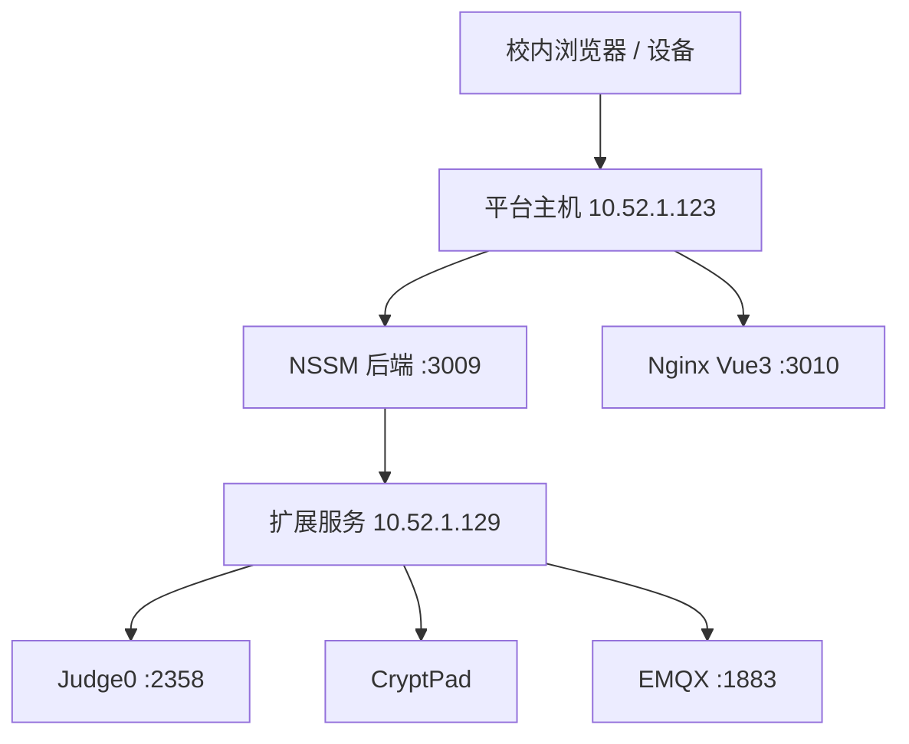

# 部署与回滚约定

## 拓扑

## 发布不变量

1. 先读取真实服务器配置、服务状态和目标库状态；历史文档只作线索。
2. 先备份目标库及相关 Nginx/NSSM/外置配置，记录非敏感校验信息。
3. SQL 仅执行仓库 `sql/` 中通过前检的相关脚本；完成后做存在性和重复数据复核。
4. 后端、前端必须发布到新的 release 目录，保留旧 release；不得直接覆盖活动版本。
5. 切换后执行构建/单测、服务探活、关键 API，UI/权限变更再做 Playwright 冒烟。
6. 汇报必须注明当前 release、回滚路径、是否需回滚 SQL、未完成门禁；不得输出凭据。

## 当前正式基线（2026-09-02）

- 版本：`1.28.3`，后端继续使用 `releases/20260901_scheme2_score_numeric_v1/backend`，3010 前端切换至 `releases/20260902_student_entry_year_grade_v1/frontend`；学生管理入学年份会按当前校区学部自动显示当前年级备注。
- 1.28.3 为前端精确发布：小学显示 `x年级`、初中显示 `初x`、高中显示 `高x`，筛选和保存值保持纯入学年份。无后端或表结构变更。发布前整库备份：`D:/program/3009dazipingtai/backups/20260902_student_entry_year_grade_v1_before/ry-vue_before.sql`，SHA-256 `9661D33CF475A2C67A80F08CB60AC257059FA95A29DF17659FE63F81106EDC3C`；平台更新 `1.28.3` 已登记为 `PUBLISHED`（update_id=68）。3009、3010、`/prod-api`、80、3012 均 HTTP 200，`UnifiedNginx` 为 Running。回滚：将 Nginx 3010 root 切回 `releases/20260902_student_correction_upload_hotfix_v1/frontend` 并重启 `UnifiedNginx`；无需后端或结构 SQL 回滚。
- 1.28.2 为前端精确热修：线上学生模块重命名为 `student-correction-upload-hotfix-20260902.js` 并替换 6 处引用；后端未重启、无业务数据或结构变更，正式上传大小限制仍为 10MB。
- 发布前整库备份：`D:/program/3009dazipingtai/backups/20260902_student_correction_upload_hotfix_v1_before_retry/ry-vue_before.sql`，SHA-256 `7CBBD9CF7BF6BB06C9EB63E2063B0E3CE817D7FB201A1DB70F12CF4887C7B8E9`；NSSM/Nginx 配置、前端包与 SQL 同目录保留。
- 平台更新 `1.28.2` 已登记为 `PUBLISHED`（update_id=67）；3009、3010、`/prod-api`、80、3012 均 HTTP 200，`UnifiedNginx` 最终为 Running。
- 回滚：将 Nginx 3010 root 切回 `releases/20260901_score_numeric_sort_hotfix_v1/frontend` 并重启 `UnifiedNginx`；数据库无结构 SQL，仅按版本精确撤销平台更新记录。
- 1.28.1 为前端热修：修复 Element Plus `sort-method` 回调参数误用，课程成绩列改用 `sort-by`；后端未重启、无业务数据变更。
- 发布前整库备份：`D:/program/3009dazipingtai/backups/20260901_scheme2_score_numeric_v1_before/ry-vue_before.sql`，SHA-256 `61BDC6848D01CADC46BB0672CF453FBBC3DD67AEC6AD9220AC7D4F34993D6364`；NSSM/Nginx 配置同目录保留。
- 本轮执行 `sql/lesson_archive_status_v1.sql` 与 `sql/platform_update_scheme2_score_numeric_v1.sql`；`biz_lesson.status` 存在，平台更新 `1.28.0` 为 `PUBLISHED`（update_id=65）。
- 正式库已新增普通索引 `idx_sys_user_name_del_flag(user_name, del_flag)`；正向和回滚脚本分别为 `sql/student_import_governance_v1.sql`、`sql/student_import_governance_v1_rollback.sql`。
- 回滚：导入备份中的 `nssm-before.reg`、恢复 `nginx.conf.before`，重启 `NewDaziBackend3009` 并重启/重载 `UnifiedNginx`；数据库新增归档字段可兼容保留，平台更新按版本精确改为草稿或删除，禁止物理删除历史成绩。
- 小学实验板 MQTT 精确 ACL 和同步状态已在 v1.27.2 完成；v1.27.3 将学生端 Python 页签设为默认，v1.27.4 将复制代码修正为 N17 的 `npython + oled.print` 格式。初中 Mind+ 兼容入口保持不变。
- 对应发布证据、备份哈希和正式验收见 `contexts/PROJECT_CORE.md` 第 26 至 31 节与 `contexts/RELEASE_LOG.md`。

## 外部服务注意事项

- Judge0、CryptPad、EMQX 是独立部署单元，不能因部署其中一个而重启或改写另一个的卷、网络、端口。
- Judge0 当前容量基线：123 `ruoyi.judge.core-pool-size=10`、`max-pool-size=10`、`queue-capacity=1000`、`judge0.class-concurrency=60`；129 `COUNT=10`、`MAX_QUEUE_SIZE=512`，server 2 CPU/2GiB，worker 10 CPU/16GiB。配置变更必须按 50/100/200/400 阶梯验收。
- 129 回滚只恢复 `/srv/judge0-python/backups/<批次>/` 中的 compose/conf 并重建 Judge0 server/workers；不得顺带停止 PostgreSQL、Redis、CryptPad 或 EMQX，更不得删除卷。
- 123 本机实测 `nssm restart NewDaziBackend3009` 可能停在 `SERVICE_STOP_PENDING` 后留下 `Stopped`。发布脚本应显式 `stop` → 等待状态变为 `SERVICE_STOPPED` → `start`，并在 3009 探活 200 后再继续；NSSM 路径统一用正斜杠，避免 PowerShell/Python 反斜杠转义破坏参数。
- CryptPad 当前内网 HTTP 状态不是正式安全验收；必须明确标识。
- EMQX 与平台 MQTT 接收器的启用是两个独立步骤，均需实测后记录。

## 教师工具统一网关（2026-08-31）

正式主机 `10.52.1.123` 的教师工具入口统一由 D 盘 Nginx 服务 `UnifiedNginx` 提供。活动配置唯一入口为 `D:/programsoftware/nginx/nginx-1.29.4/conf/nginx.conf`；该服务自动启动并监听 80、3010、3012。C 盘 `OpenResty` 已停止并禁用，旧 D 盘 Nginx 计划任务已禁用，禁止再向 C 盘配置或旧计划任务写入变更。

| 外部路径 | 内部目标 |
| --- | --- |
| `/tools/mail/` | `127.0.0.1:3002`（HTTP.sys） |
| `/tools/primary-lab/` | `127.0.0.1:3003` |
| `/tools/network/` | `127.0.0.1:3020` |
| `/tools/iot-data/` | `127.0.0.1:3006` |
| `/tools/image-recognition/` | `127.0.0.1:3001` |

3006 由 NSSM 服务 `TeacherToolIotData3006` 管理，自动启动并配置异常自动重启。教师工具数据库地址必须使用上述 80 端口路径，不应要求教师直接访问 3001/3002/3003/3006/3020。修改网关时先备份并在 D 盘 `conf` 目录生成候选文件做 `nginx -t`，切换后确认 80/3010/3012 均由 `UnifiedNginx` 同一进程树监听。
