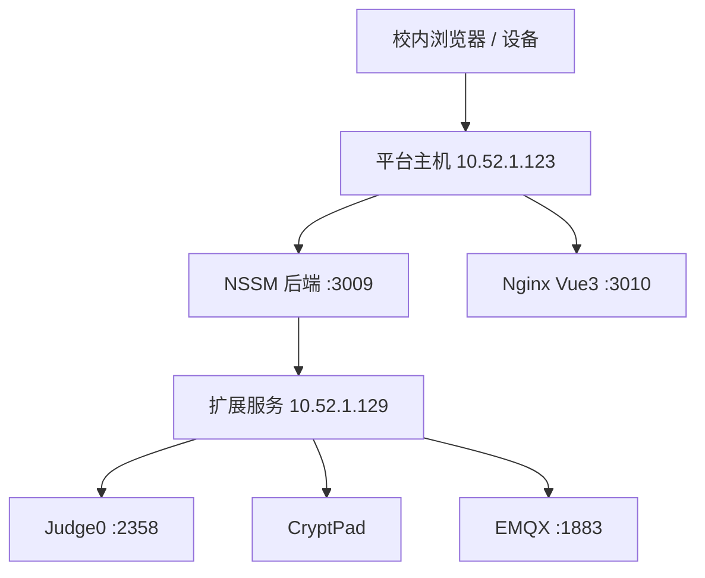

# 部署与回滚约定

## 拓扑

## 发布不变量

1. 先读取真实服务器配置、服务状态和目标库状态；历史文档只作线索。
2. 先备份目标库及相关 Nginx/NSSM/外置配置，记录非敏感校验信息。
3. SQL 仅执行仓库 `sql/` 中通过前检的相关脚本；完成后做存在性和重复数据复核。
4. 后端、前端必须发布到新的 release 目录，保留旧 release；不得直接覆盖活动版本。
5. 切换后执行构建/单测、服务探活、关键 API，UI/权限变更再做 Playwright 冒烟。
6. 汇报必须注明当前 release、回滚路径、是否需回滚 SQL、未完成门禁；不得输出凭据。

## 外部服务注意事项

- Judge0、CryptPad、EMQX 是独立部署单元，不能因部署其中一个而重启或改写另一个的卷、网络、端口。
- CryptPad 当前内网 HTTP 状态不是正式安全验收；必须明确标识。
- EMQX 与平台 MQTT 接收器的启用是两个独立步骤，均需实测后记录。
