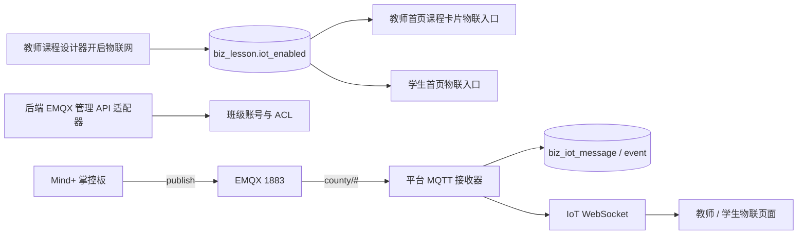

# 外部协议与实时链路

## Judge0

- 调用方向：平台后端 → Judge0，浏览器不直接请求 Judge0。
- 配置：`JUDGE0_*` 环境变量；令牌只在私密部署配置。
- 用途：Python 课程题与独立刷题共用判题客户端、异步执行、限流和结果脱敏。
- 失败处理：服务关闭或不可用时，保留提交状态并反馈服务错误，不能写零分替代。

## CryptPad

- 调用方向：Vue3 编辑页加载 Integration API；平台后端签发受限会话并保存平台侧房间/版本。
- 身份：平台生成稳定参与者 ID，显示名不暴露内部 ID；OnlyOffice 参与人列表由 `users[nId].name`（成员表名字）优先，本地 `integrationConfig.user.name` 仅作兜底——该修复通过服务器侧 `patches/inner.js` 只读挂载覆盖容器内 `/cryptpad/www/common/onlyoffice/inner.js` 完成，改镜像/重建容器时不得丢失挂载。
- 当前协议限制：内网 HTTP/WS 仅作临时验收，恢复可信 HTTPS/WSS 后才可作为正式安全结论。
- 验收重点：同班访问、跨班/跨校拒绝、多人编辑、刷新保留、保存回调和版本递增。

## EMQX / MQTT

- Topic 规范：`county/{schoolId}/{courseId}/{classCode}/{experimentId}/group{groupId}/data`。
- 账号策略：同班共享班级账号和易读课堂口令；Broker ACL 限制班级前缀，班内再按业务 Topic 隔离。
- 课程级开关：物联入口按 `biz_lesson.iot_enabled` 控制（教师设计器开启、考勤课强制关闭），教师/学生首页与接口均按此过滤；学生概览与教师收集接口还要校验课程已开启。
- 生产现状（2026-08-21）：EMQX 5.8.8 @ 10.52.1.129；1883 设备接入；管理 API 18083 已开放给内网（原仅 127.0.0.1），平台后端经 `dazi-backend` API 密钥同步班级账号；平台接收器 `IOT_MQTT_ENABLED=true`，以 `platform_iot_subscriber` 订阅 `county/#`；ACL 文件规则：订阅账号只读订阅 county/#、`class_*` 设备收发、device01 测试、deny all。
- 开关：平台接收器由 `IOT_MQTT_ENABLED` 外置开启，默认关闭；启用前必须验证 SQL、Broker API、订阅账号、ACL 和真实硬件链路。
- 禁区：学生浏览器不持有 Broker 管理凭据，不能把旧 SIoT 共享弱账号作为多校正式方案。
- 接收器保护：默认关闭；启用后同时受全局每分钟消息上限（默认 5000）、单 Topic 每分钟上限、Topic 长度上限（默认 256）及通配符/控制字符校验约束。上线前仍须结合 Broker ACL 和真实硬件链路复核容量。
- 启动行为：接收器在开关开启时通过 `threadPoolTaskExecutor` 异步连接 Broker，避免不可达 Broker 阻塞 Spring 主线程；连接失败写入诊断事件，默认关闭时不建立连接。
- 课堂口令密钥：`IOT_PASSCODE_SECRET` 只允许由部署环境注入，源码和配置文件不提供默认值；缺少密钥时不允许生成/轮换口令或导出课堂配置卡。生产已注入的密钥与历史默认值一致，保证既有密文可解；更换密钥必须先把存量密文全部重加密。学生概览接口还必须校验 `lessonId` 是本人班级当前指派课程。

## WPS 历史回调

- WPS 路线已退役，回调 Controller 保留兼容代码但默认由 `WPS_WEBOFFICE_ENABLED=false` 独立门禁阻断；只有协作总开关和该开关同时开启才允许进入业务层。CryptPad 是当前协作 Provider。

## WebSocket

- 导学单、课堂和 IoT 均为后端 WebSocket，不以浏览器直接连 Broker 代替。
- 改动时同时验证 Origin、握手身份、课程/班级范围、断线重连和跨房间隔离。

## 2026-08-21 验收口径（覆盖 2026-08-20）

- CryptPad `/checkup/` 与基础 API 可达只证明服务探活；当前 HTTP/WS 明确是临时验收态，不代表正式传输安全，也不替代同班多人、刷新恢复和保存版本递增验收。
- Judge0 根地址可达但接口受鉴权保护；没有可用隔离令牌时不得绕过鉴权开展并发压测。
- EMQX：平台接收器已在正式环境启用并连上 broker（订阅 county/#）；ACL、订阅账号、管理 API 密钥均已配置生效；教师收集页与小组统计待真实设备上报后验证。
