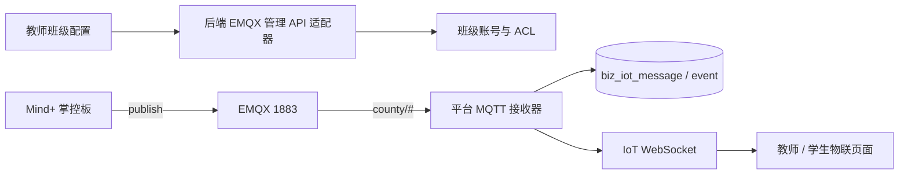

# 外部协议与实时链路

## Judge0

- 调用方向：平台后端 → Judge0，浏览器不直接请求 Judge0。
- 配置：`JUDGE0_*` 环境变量；令牌只在私密部署配置。
- 用途：Python 课程题与独立刷题共用判题客户端、异步执行、限流和结果脱敏。
- 失败处理：服务关闭或不可用时，保留提交状态并反馈服务错误，不能写零分替代。

## CryptPad

- 调用方向：Vue3 编辑页加载 Integration API；平台后端签发受限会话并保存平台侧房间/版本。
- 身份：平台生成稳定参与者 ID，显示名不暴露内部 ID。
- 当前协议限制：内网 HTTP/WS 仅作临时验收，恢复可信 HTTPS/WSS 后才可作为正式安全结论。
- 验收重点：同班访问、跨班/跨校拒绝、多人编辑、刷新保留、保存回调和版本递增。

## EMQX / MQTT

- Topic 规范：`county/{schoolId}/{courseId}/{classCode}/{experimentId}/group{groupId}/data`。
- 账号策略：同班共享班级账号和易读课堂口令；Broker ACL 限制班级前缀，班内再按业务 Topic 隔离。
- 开关：平台接收器由 `IOT_MQTT_ENABLED` 外置开启，默认关闭；启用前必须验证 SQL、Broker API、订阅账号、ACL 和真实硬件链路。
- 禁区：学生浏览器不持有 Broker 管理凭据，不能把旧 SIoT 共享弱账号作为多校正式方案。

## WebSocket

- 导学单、课堂和 IoT 均为后端 WebSocket，不以浏览器直接连 Broker 代替。
- 改动时同时验证 Origin、握手身份、课程/班级范围、断线重连和跨房间隔离。
