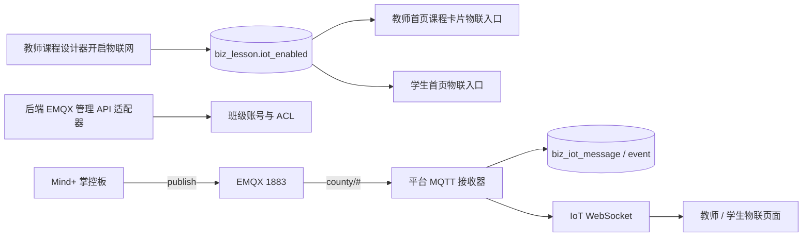

# 外部协议与实时链路

## Judge0

- 调用方向：平台后端 → Judge0，浏览器不直接请求 Judge0。
- 配置：`JUDGE0_*` 环境变量；令牌只在私密部署配置。
- 用途：Python 课程题与独立刷题共用判题客户端、异步执行、限流和结果脱敏。
- 失败处理：服务关闭或不可用时，保留提交状态并反馈服务错误，不能写零分替代。
- 生产容量（2026-08-23）：400 份提交可同时落库并进入排队链路，123 判题执行器为 10 核心线程 / 10 最大线程 / 1000 队列，课程并发门限 60；129 为 10 个真实 worker、Judge0 队列 512。这里的 400 是排队容量，不是 400 个并行沙箱。
- 已验收：50/100/200/400 四档单用例 `CUSTOM_RUN` 均 100% 接收且全部 Accepted；400 档接口 P95 约 1.01s，接口接收后约 22.2s 排空。浏览器仍不持有 Judge0 地址或令牌。
- 共享主机边界：129 同时承载 CryptPad 与 EMQX，Judge0 worker 限额 10 CPU / 16GiB；继续增大 worker 前必须复跑阶梯压测并同步验证另外两项服务。

## CryptPad

- 调用方向：Vue3 编辑页加载 Integration API；平台后端签发受限会话并保存平台侧房间/版本。
- 身份：平台生成稳定参与者 ID，显示名不暴露内部 ID；OnlyOffice 参与人列表由 `users[nId].name`（成员表名字）优先，本地 `integrationConfig.user.name` 仅作兜底——该修复通过服务器侧 `patches/inner.js` 只读挂载覆盖容器内 `/cryptpad/www/common/onlyoffice/inner.js` 完成，改镜像/重建容器时不得丢失挂载。
- 当前协议限制：内网 HTTP/WS 仅作临时验收，恢复可信 HTTPS/WSS 后才可作为正式安全结论。
- 验收重点：同班访问、跨班/跨校拒绝、多人编辑、刷新保留、保存回调和版本递增。
- P3 小组扩展在平台侧按课时快照将每个小组映射到独立房间副本。学生会话只允许本人快照小组房间，记录进入、30 秒心跳、离开和保存事件；保存后的相邻 revision 结构摘要通过 `conversionExecutor` 异步提取，失败只写审计结果。保存触发者不是全部内容作者。
- 本机已迁移相关结构并通过定向服务测试；尚未做真实多人、多文件、断线恢复或容量验收，正式服务器未迁移。

## EMQX / MQTT

- Topic 规范：`county/{schoolId}/{courseId}/{classCode}/{experimentId}/group{groupId}/data`。
- 账号策略：同班共享班级账号和易读课堂口令；Broker ACL 限制班级前缀，班内再按业务 Topic 隔离。
- 课程级开关：物联入口按 `biz_lesson.iot_enabled` 控制（教师设计器开启、考勤课强制关闭），教师/学生首页与接口均按此过滤；学生概览与教师收集接口还要校验课程已开启。
- 生产现状（2026-08-21）：EMQX 5.8.8 @ 10.52.1.129；1883 设备接入；管理 API 18083 已开放给内网（原仅 127.0.0.1），平台后端经 `dazi-backend` API 密钥同步班级账号；平台接收器 `IOT_MQTT_ENABLED=true`，以 `platform_iot_subscriber` 订阅 `county/#`；ACL 文件规则：订阅账号只读订阅 county/#、`class_*` 设备收发、device01 测试、deny all。
- 小学实验板兼容验证（2026-08-31 已通过）：真实板可直接导入 `umqtt.simple.MQTTClient`，显式设置 ClientID、用户名、密码和完整 `county/.../data` Topic，省平台 `userId/projectId` 封装不是技术依赖。实验板经临时账号 `primary_board_probe` 直连正式 EMQX，并于 `2026-08-31 09:19:19` 向精确授权 Topic 发布 JSON；平台接收器成功映射实验 1 / 小组 45，生成消息 8966 与 `MESSAGE_RECEIVED` 事件 9025。由此确认“真实小学实验板 → 129 EMQX → 123平台接收器 → 正式数据库”链路闭环；教师页面可视验收不属于本次服务器侧证据。
- 小学接入正式实现（2026-08-31，release `20260831_primary_iot_v1`）：`biz_iot_class_config` 已增加 `broker_sync_status`、`broker_synced_at`、`broker_sync_error` 三列；后端仅在账号与精确 ACL 同步成功后向教师/学生返回可运行口令和 Python 配置，失败时保留脱敏状态并支持教师重试。正式库 8 条班级配置均为 `SYNCED`；EMQX 内置数据库授权源已启用并按班级回填精确 ACL，`class_* → county/#` 宽规则及临时探针账号已删除。IoT 相关测试 15/15、Vue3 生产构建和正式 MQTT 本班/跨班/订阅隔离验收均通过。
- 学生端入口修复（2026-08-31，release `20260831_primary_iot_student_python_v2`）：小学实验板 Python 页签默认打开并提供一键复制本人小组代码；初中 Mind+ 参数页签继续保留，后端协议和权限不变。
- 开关：平台接收器由 `IOT_MQTT_ENABLED` 外置开启，默认关闭；启用前必须验证 SQL、Broker API、订阅账号、ACL 和真实硬件链路。
- 禁区：学生浏览器不持有 Broker 管理凭据，不能把旧 SIoT 共享弱账号作为多校正式方案。
- 运维路径：129 的 SSH 只经 123 跳板访问；小学实验板临时 ACL 修改前备份为 `/srv/emqx-school-poc/backups/20260830_050321_before_primary_board_probe/acl.conf`（SHA-256 `6e7df6236dcb759e08831542b40f6124eb3ccb7207bea0644293944454ab37f3`）。回滚时删除临时认证账号、移除对应单 Topic 文件规则；不重启 Judge0、CryptPad 或平台服务。
- 接收器保护：默认关闭；启用后同时受全局每分钟消息上限（默认 5000）、单 Topic 每分钟上限、Topic 长度上限（默认 256）及通配符/控制字符校验约束。上线前仍须结合 Broker ACL 和真实硬件链路复核容量。
- 启动行为：接收器在开关开启时通过 `threadPoolTaskExecutor` 异步连接 Broker，避免不可达 Broker 阻塞 Spring 主线程；连接失败写入诊断事件，默认关闭时不建立连接。
- 课堂口令密钥：`IOT_PASSCODE_SECRET` 只允许由部署环境注入，源码和配置文件不提供默认值；缺少密钥时不允许生成/轮换口令或导出课堂配置卡。生产已注入的密钥与历史默认值一致，保证既有密文可解；更换密钥必须先把存量密文全部重加密。学生概览接口还必须校验 `lessonId` 是本人班级当前指派课程。

## WPS 历史回调

- WPS 路线已退役，回调 Controller 保留兼容代码但默认由 `WPS_WEBOFFICE_ENABLED=false` 独立门禁阻断；只有协作总开关和该开关同时开启才允许进入业务层。CryptPad 是当前协作 Provider。

## WebSocket

- 导学单、课堂和 IoT 均为后端 WebSocket，不以浏览器直接连 Broker 代替。
- 改动时同时验证 Origin、握手身份、课程/班级范围、断线重连和跨房间隔离。

### 2026-09-03 Presence 规划与课堂任务状态

- 学生桌面计划增加独立受认证 Presence WebSocket，学生登录后的公共布局连接；30 秒心跳、60 秒 Redis TTL 离线，不逐心跳写 MySQL。
- 连接 IP 由服务端从可信代理链观察。普通浏览器不能保证读取真实局域网 IP 或计算机名；经过 NAT 时允许多个终端显示同一出口地址。
- 主入口在班级管理行内，教师首页提供课程/班级快捷入口；该状态不写签到考勤。
- 课堂任务状态核心链已在本地实现：现有课堂 WebSocket 保留三段兼容路径，并增加带 `lessonId` 的四段路径；学生只可订阅当前课程，教师历史课程订阅还要校验课程班级关系和管理范围。
- 状态事件统一为版本化 `TASK_STATE_UPDATE`：主业务事务提交后才以独立事务写状态，该状态事务提交后才发布；状态失败只告警，批改页按版本丢弃旧消息、合并刷新并每 10 秒 REST 校准，教师首页也每 10 秒校准操作题状态。新增 SQL 未执行、正式服务未发布。
- 该课堂任务连接不能替代 Presence：它只服务课程房间与作业状态，不持有终端 TTL、连接 IP 或多设备聚合。
- 详细契约和容量门禁见 `contexts/class-grouping-and-desktop/ADR-001-server-observed-presence-and-class-entry.md` 与 `contexts/multi-feature-upgrade-20260902/design.md`。

## 2026-08-21 验收口径（覆盖 2026-08-20）

- CryptPad `/checkup/` 与基础 API 可达只证明服务探活；当前 HTTP/WS 明确是临时验收态，不代表正式传输安全，也不替代同班多人、刷新恢复和保存版本递增验收。
- Judge0 根地址可达但接口受鉴权保护；没有可用隔离令牌时不得绕过鉴权开展并发压测。
- EMQX：平台接收器已在正式环境启用并连上 broker（订阅 county/#）；内置数据库班级账号、精确 ACL、订阅账号和管理 API 密钥均已配置生效，跨班发布与订阅拒绝已验证。教师收集页、小组统计、双板 10 分钟到达率和断网恢复仍待真实课堂试点。
