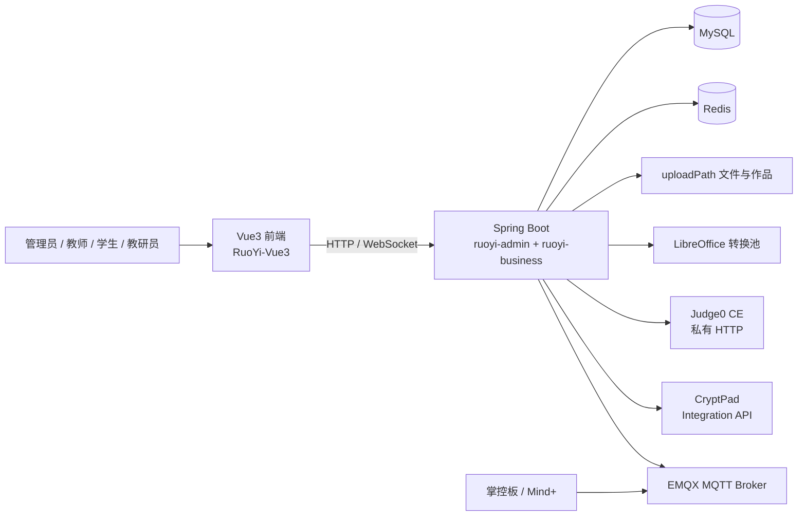
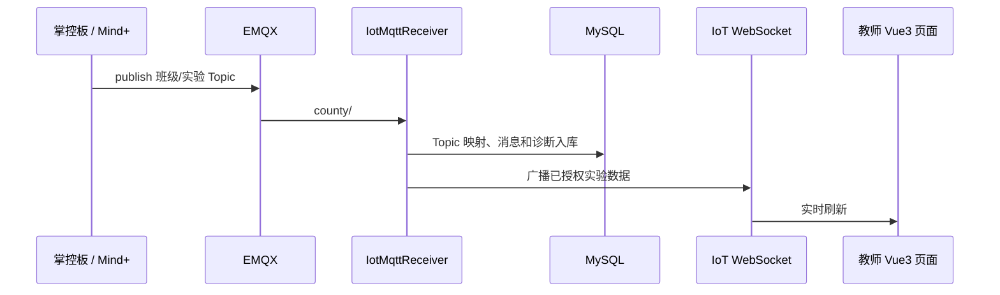

# 系统架构

## 组件关系

## 代码分层

- `ruoyi-admin`：应用启动、资源配置和聚合依赖。
- `ruoyi-business`：业务 Controller、Service、Provider、异步任务、WebSocket、MyBatis Mapper 和业务测试。
- `ruoyi-framework`、`ruoyi-system`、`ruoyi-common`：RuoYi 基础能力、认证、权限、缓存与通用工具。
- `RuoYi-Vue3/src/api`：前端 API 封装；`views`：角色和业务页面；`router`、`permission.js`：前端路由与守卫。

动态路由、Spring 注入、MyBatis XML 和反射会让静态调用图不完整。因此排查端到端链路必须至少核对：前端 API → Controller → Service → Mapper XML/SQL → 权限校验 → 单测或接口证据。

## 真实时间链路

