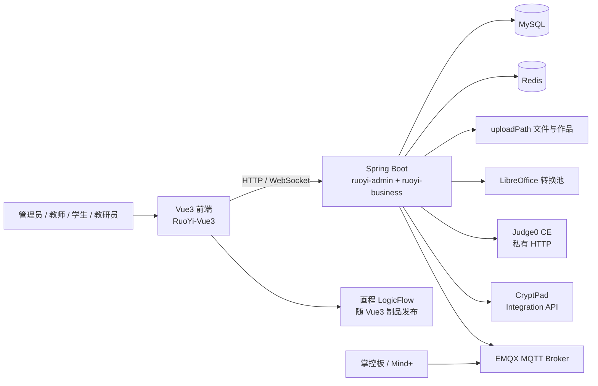
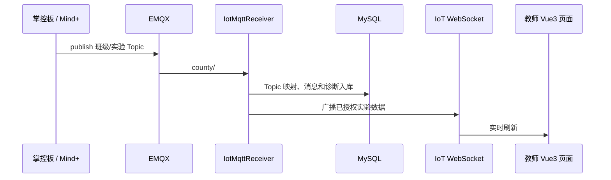

# 系统架构

## 组件关系

## 代码分层

- `ruoyi-admin`：应用启动、资源配置和聚合依赖。
- `ruoyi-business`：业务 Controller、Service、Provider、异步任务、WebSocket、MyBatis Mapper 和业务测试。
- `ruoyi-framework`、`ruoyi-system`、`ruoyi-common`：RuoYi 基础能力、认证、权限、缓存与通用工具。
- `RuoYi-Vue3/src/api`：前端 API 封装；`views`：角色和业务页面；`router`、`permission.js`：前端路由与守卫。

动态路由、Spring 注入、MyBatis XML 和反射会让静态调用图不完整。因此排查端到端链路必须至少核对：前端 API → Controller → Service → Mapper XML/SQL → 权限校验 → 单测或接口证据。

画程的 LogicFlow 仅是 Vue3 内嵌图编辑底座，不是独立服务，也不拥有课程权限或作品真源。教师配置、课程快照、学生草稿、正式提交、结构检查和成绩确认均由 `ruoyi-business` 与 MySQL 承担；浏览器离线备份只用于防丢和冲突恢复，不能绕过服务端修订号与交卷事务。流程图预览只返回学生基础图和不泄露答案的配置完成状态；课程设计器与课程快照均拒绝半成品或无法规范化的旧配置。流程图文字安全校验由前后端共同执行，服务端是最终边界。流程图 AI 批改复用普通文档操作题任务队列：服务端把学生提交和课程标准答案 JSON 渲染为图片，视觉模型以图片为主要依据，JSON/结构检查作为辅助上下文，建议分只有教师确认后才进入正式成绩。

## 真实时间链路

